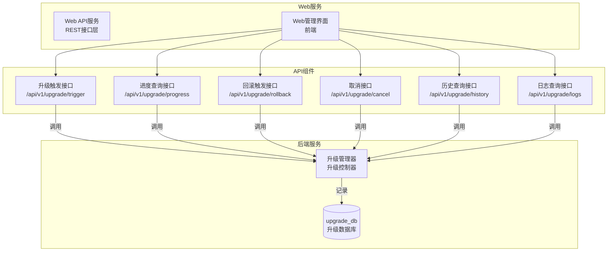
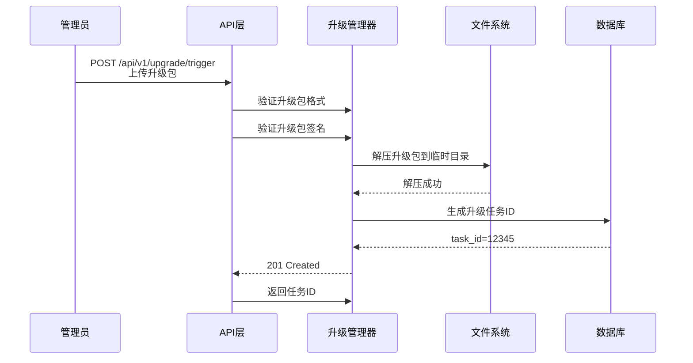
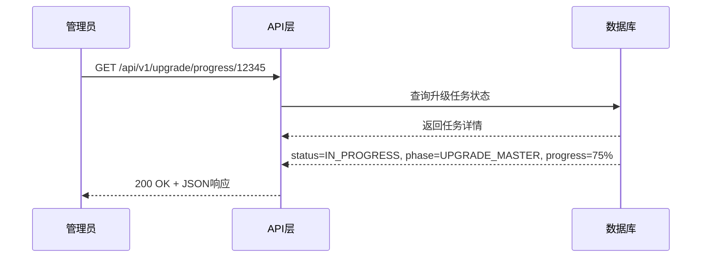
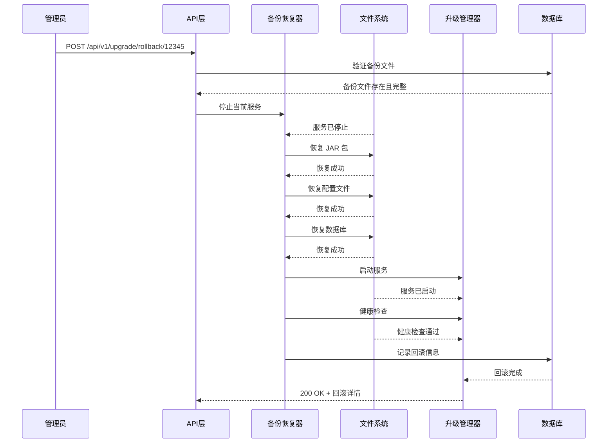
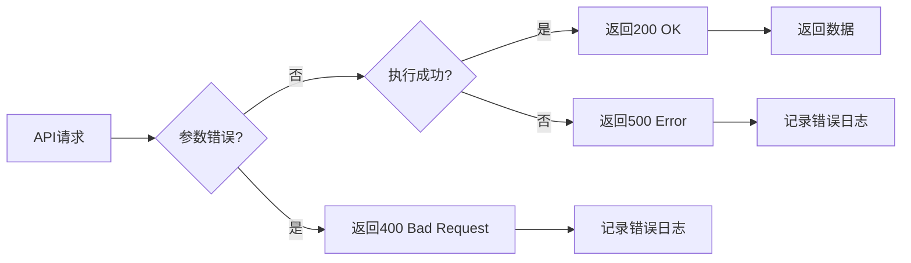
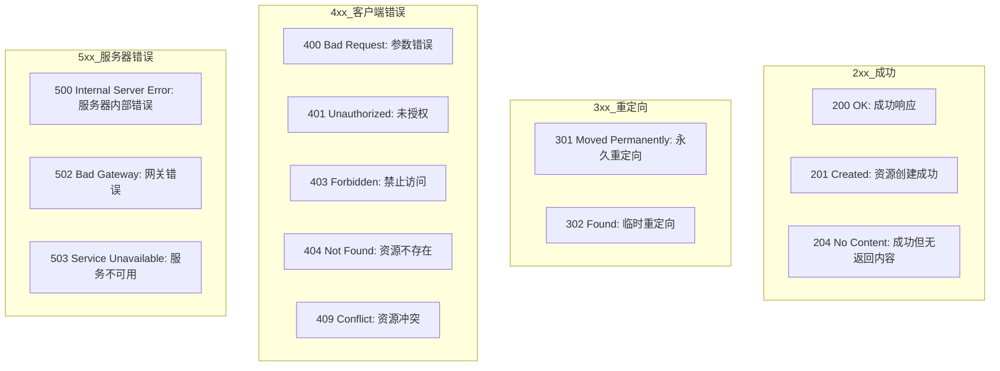

# 升级接口定义

## ADDED Requirements

### Requirement: 系统提供升级触发接口

系统 SHALL 提供 REST API 接口，用于接收用户上传的升级包并触发升级流程。

#### Scenario: 成功的升级触发
- **WHEN** 管理员通过 POST 方法向 `/api/v1/upgrade/trigger` 接口上传升级包
- **THEN** 系统 SHALL：
  1. 验证升级包格式和签名
  2. 解压升级包到临时目录
  3. 生成升级任务 ID
  4. 返回 HTTP 201 Created 状态和升级任务 ID

#### Scenario: 升级包格式错误
- **WHEN** 上传的升级包格式不正确或文件损坏
- **THEN** 系统 SHALL：
  1. 返回 HTTP 400 Bad Request 状态
  2. 错误信息：`message`: "升级包格式错误"
  3. 记录错误日志

#### Scenario: 升级包签名验证失败
- **WHEN** 升级包签名校验和不匹配
- **THEN** 系统 SHALL：
  1. 返回 HTTP 403 Forbidden 状态
  2. 错误信息：`message`: "升级包签名验证失败"
  3. 记录安全告警日志

#### Scenario: 升级流程正在执行
- **WHEN** 尝试触发新的升级但系统中有进行中的升级任务
- **THEN** 系统 SHALL：
  1. 返回 HTTP 409 Conflict 状态
  2. 错误信息：`message`: "系统中有正在进行的升级任务"
  3. 提供当前升级任务 ID

---

### Requirement: 系统提供升级进度查询接口

系统 SHALL 提供接口查询升级进度，包括当前阶段、进度百分比、日志等。

#### Scenario: 查询升级进度
- **WHEN** 管理员通过 GET 方法调用 `/api/v1/upgrade/progress/{upgrade_id}` 接口
- **THEN** 系统 SHALL 返回：
  1. HTTP 200 OK 状态
  2. 升级任务 ID
  3. 当前阶段（PREPARE / BACKUP / UPGRADE_BACKUP / UPGRADE_MASTER / VIP_SWITCH / VERIFY / COMPLETE）
  4. 进度百分比（0-100）
  5. 已完成的步骤列表
  6. 当前日志消息
  7. 开始时间和预计完成时间

#### Scenario: 升级任务不存在
- **WHEN** 查询的升级任务 ID 不存在
- **THEN** 系统 SHALL：
  1. 返回 HTTP 404 Not Found 状态
  2. 错误信息：`message`: "升级任务不存在"

#### Scenario: 查询参数错误
- **WHEN** 查询参数错误（upgrade_id 格式错误等）
- **THEN** 系统 SHALL：
  1. 返回 HTTP 400 Bad Request 状态
  2. 错误信息：`message`: "查询参数错误"

---

### Requirement: 系统提供回滚触发接口

系统 SHALL 提供接口用于手动触发回滚操作，恢复到升级前状态。

#### Scenario: 成功的回滚触发
- **WHEN** 管理员通过 POST 方法向 `/api/v1/upgrade/rollback/{upgrade_id}` 接口触发回滚
- **THEN** 系统 SHALL：
  1. 验证备份文件存在且完整
  2. 停止当前服务
  3. 恢复 JAR 包
  4. 恢复配置文件（特别是根密钥）
  5. 恢复数据库
  6. 启动服务并执行健康检查
  7. 记录回滚时间到 upgrade_history
  8. 返回 HTTP 200 OK 状态和回滚详情

#### Scenario: 备份文件不存在或损坏
- **WHEN** 触发回滚但备份文件不存在或校验和匹配
- **THEN** 系统 SHALL：
  1. 返回 HTTP 400 Bad Request 状态
  2. 错误信息：`message`: "备份文件不存在或损坏"
  3. 记录回滚失败日志

#### Scenario: 升级任务已完成或正在执行
- **WHEN** 触发回滚但升级任务已完成或正在进行中
- **THEN** 系统 SHALL：
  1. 返回 HTTP 409 Conflict 状态
  2. 错误信息：`message`: "升级任务已完成或正在进行，无法回滚"
  3. 记录回滚失败日志

#### Scenario: 回滚执行失败
- **WHEN** 回滚过程中任一操作失败（文件恢复、服务启动、数据库恢复等）
- **THEN** 系统 SHALL：
  1. 停止回滚流程
  2. 记录详细失败日志
  3. 返回 HTTP 500 Internal Server Error 状态
  4. 错误信息：`message`: "回滚执行失败"
  5. 保持当前状态不变

---

### Requirement: 系统支持升级任务取消接口

系统 SHALL 提供接口用于取消正在进行的升级任务。

#### Scenario: 成功的取消升级
- **WHEN** 管理员通过 POST 方法向 `/api/v1/upgrade/cancel/{upgrade_id}` 接口取消升级
- **THEN** 系统 SHALL：
  1. 标记升级任务状态为 CANCELLED
  2. 停止升级流程
  3. 恢复 rsync 同步
  4. 清理临时文件
  5. 记录取消时间和原因
  6. 返回 HTTP 200 OK 状态

#### Scenario: 取消不存在的升级任务
- **WHEN** 尝试取消不存在的升级任务
- **THEN** 系统 SHALL：
  1. 返回 HTTP 404 Not Found 状态
  2. 错误信息：`message`: "升级任务不存在"

#### Scenario: 取消已完成的升级任务
- **WHEN** 尝试取消已完成的升级任务
- **THEN** 系统 SHALL：
  1. 返回 HTTP 409 Conflict 状态
  2. 错误信息：`message`: "升级任务已完成，无法取消"
  3. 记录操作日志

---

### Requirement: 系统支持升级历史查询接口

系统 SHALL 提供接口查询历史升级记录，支持分页和筛选。

#### Scenario: 查询升级历史
- **WHEN** 管理员通过 GET 方法调用 `/api/v1/upgrade/history` 接口并传递查询参数
- **THEN** 系统 SHALL 返回：
  1. HTTP 200 OK 状态
  2. 升级历史列表（分页）
  3. 总记录数
  4. 分页参数（page, page_size, total_pages）
  5. 每条记录的详细信息（ID、状态、版本、时间、耗时等）

#### Scenario: 查询参数错误
- **WHEN** 查询参数错误（负数页码、超出范围等）
- **THEN** 系统 SHALL：
  1. 返回 HTTP 400 Bad Request 状态
  2. 错误信息：`message`: "查询参数错误"

#### Scenario: 分页参数
- **WHEN** 查询时未提供分页参数
- **THEN** 系统 SHALL 使用默认值（page=1, page_size=20）

---

### Requirement: 系统支持日志查询接口

系统 SHALL 提供接口查询升级日志，用于故障排查。

#### Scenario: 查询升级日志
- **WHEN** 管理员通过 GET 方法调用 `/api/v1/upgrade/logs/{upgrade_id}` 接口查询日志
- **THEN** 系统 SHALL 返回：
  1. HTTP 200 OK 状态
  2. 日志列表（按时间倒序）
  3. 每条日志包含：时间戳、日志级别、来源、消息
  4. 支持分页查询
  5. 支持按日志级别筛选（INFO / WARNING / ERROR）

#### Scenario: 升级任务不存在
- **WHEN** 查询的升级任务 ID 不存在
- **THEN** 系统 SHALL：
  1. 返回 HTTP 404 Not Found 状态
  2. 错误信息：`message`: "升级任务不存在"

#### Scenario: 日志查询参数错误
- **WHEN** 日志查询参数错误（无效的日志级别、分页参数错误等）
- **THEN** 系统 SHALL：
  1. 返回 HTTP 400 Bad Request 状态
  2. 错误信息：`message`: "日志查询参数错误"

---

## 数据模型

### 升级任务表（upgrade_task）

| 字段名 | 类型 | 描述 | 约束 |
|--------|------|------|--------|
| task_id | BIGINT | 任务唯一标识 | PRIMARY KEY, AUTO_INCREMENT |
| task_type | VARCHAR(20) | 任务类型 | NOT NULL, VALUES ('UPGRADE', 'ROLLBACK', 'CANCEL') |
| package_path | VARCHAR(500) | 升级包路径 | NULLABLE |
| package_version | VARCHAR(50) | 升级包版本号 | NULLABLE |
| package_size | BIGINT | 升级包大小（字节） | NULLABLE |
| current_phase | VARCHAR(50) | 当前阶段 | NULLABLE, VALUES ('PREPARE', 'BACKUP', 'UPGRADE_BACKUP', 'UPGRADE_MASTER', 'VIP_SWITCH', 'VERIFY', 'COMPLETE', 'CANCELLED', 'FAILED') |
| progress_percentage | INT | 进度百分比（0-100） | NULLABLE |
| status | VARCHAR(20) | 任务状态 | NOT NULL, VALUES ('PENDING', 'IN_PROGRESS', 'SUCCESS', 'FAILED', 'CANCELLED') |
| error_message | TEXT | 错误消息 | NULLABLE |
| start_time | DATETIME | 开始时间 | NOT NULL, DEFAULT CURRENT_TIMESTAMP |
| end_time | DATETIME | 结束时间 | NULLABLE |
| created_at | DATETIME | 创建时间 | NOT NULL, DEFAULT CURRENT_TIMESTAMP |
| updated_at | DATETIME | 更新时间 | NOT NULL, DEFAULT CURRENT_TIMESTAMP ON UPDATE CURRENT_TIMESTAMP |

### API 请求记录表（api_request_log）

| 字段名 | 类型 | 描述 | 约束 |
|--------|------|------|--------|
| request_id | BIGINT | 请求唯一标识 | PRIMARY KEY, AUTO_INCREMENT |
| request_path | VARCHAR(200) | 请求路径（例如：/api/v1/upgrade/trigger） | NOT NULL |
| request_method | VARCHAR(10) | HTTP 方法（GET / POST / PUT / DELETE） | NOT NULL |
| client_ip | VARCHAR(50) | 客户端 IP | NULLABLE |
| request_params | TEXT | 请求参数（JSON 格式） | NULLABLE |
| response_status_code | INT | HTTP 响应状态码 | NOT NULL |
| response_time_ms | INT | 响应时间（毫秒） | NULLABLE |
| created_at | DATETIME | 请求时间 | NOT NULL, DEFAULT CURRENT_TIMESTAMP |

---

## 部署视图

### API 层部署架构

---

## 运行视图

### 升级触发流程

### 升级进度查询流程

### 回滚触发流程

### 错误处理流程

### API 响应状态码定义

