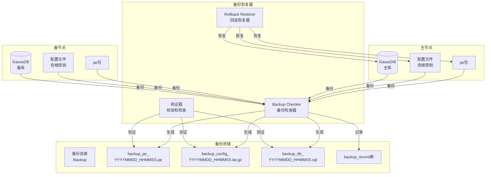
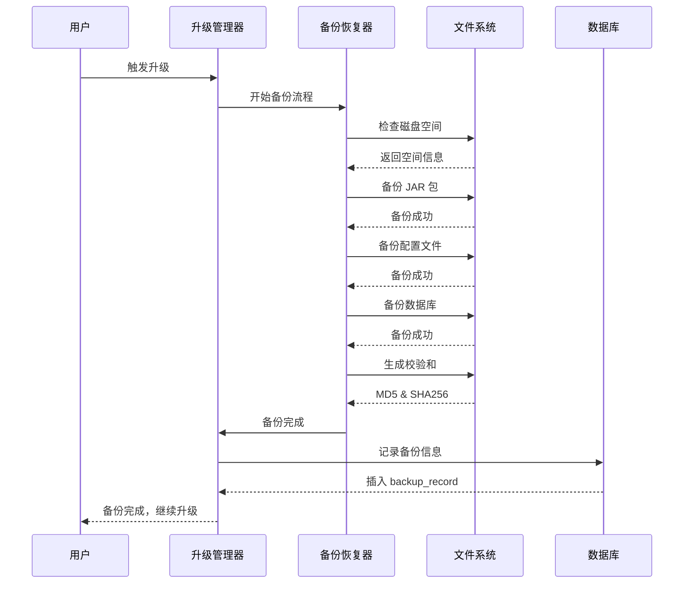
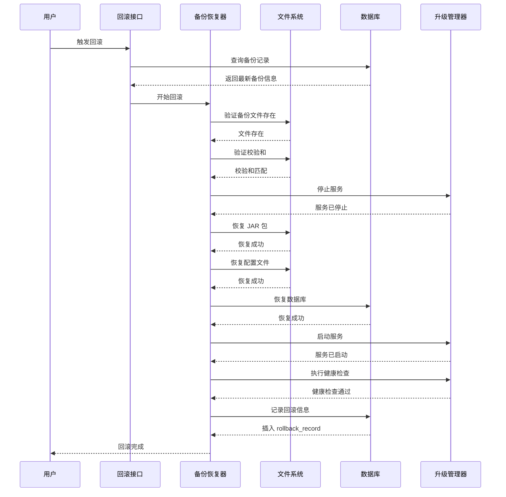
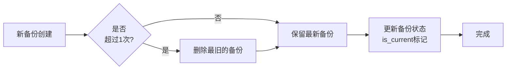
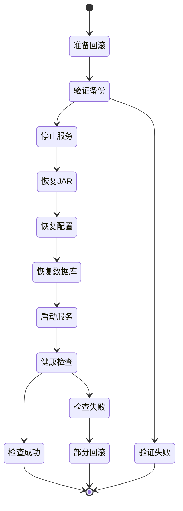

# 备份和回滚管理

## ADDED Requirements

### Requirement: 系统支持升级前自动备份

系统 SHALL 在升级开始前自动备份代码包（jar）、配置文件（包括根密钥）、数据库（全量）。

#### Scenario: 成功的升级前备份
- **WHEN** 升级流程开始且系统处于准备阶段
- **THEN** 系统 SHALL 执行以下备份：
  1. 备份当前版本的 JAR 包到备份目录
  2. 备份所有配置文件，特别记录根密钥文件路径
  3. 执行数据库全量备份
  4. 生成备份记录，记录备份文件路径、大小、校验和
  5. 所有备份按时间戳命名（格式：backup_YYYYMMDD_HHMMSS）

#### Scenario: 备份失败
- **WHEN** 任何备份步骤失败（JAR 包、配置文件、数据库）
- **THEN** 系统 SHALL：
  1. 立即停止升级流程
  2. 报错并记录详细失败原因
  3. 清理已创建的部分备份文件
  4. 标记升级状态为 "FAILED"

#### Scenario: 备份空间不足
- **WHEN** 备份目录磁盘空间不足
- **THEN** 系统 SHALL：
  1. 检查备份目录空间大小
  2. 预先验证所需空间是否足够
  3. 如果不足，提前报错并提示所需空间

---

### Requirement: 系统保留最近 1 次升级的备份

系统 SHALL 自动清理旧备份，仅保留最近 1 次升级的备份，按时间戳命名。

#### Scenario: 自动清理旧备份
- **WHEN** 新备份创建成功
- **THEN** 系统 SHALL：
  1. 查找所有历史备份记录
  2. 保留最新的 1 次备份
  3. 删除之前的备份文件和记录
  4. 记录清理日志

#### Scenario: 备份命名规范
- **WHEN** 创建新备份
- **THEN** 备份文件 SHALL 按以下格式命名：
  - JAR 包：`backup_jar_20250107_143025.jar`
  - 配置文件：`backup_config_20250107_143025.tar.gz`
  - 数据库备份：`backup_db_20250107_143025.sql`

---

### Requirement: 系统支持手动触发回滚

系统 SHALL 提供手动回滚功能，升级失败时仅报错不自动回滚。

#### Scenario: 成功的手动回滚
- **WHEN** 用户手动触发回滚且备份文件存在且完整
- **THEN** 系统 SHALL 执行以下回滚流程：
  1. 验证备份文件完整性（校验和检查）
  2. 停止当前服务
  3. 恢复 JAR 包到备份版本
  4. 恢复配置文件（特别是根密钥）
  5. 恢复数据库到备份版本
  6. 启动服务并执行健康检查
  7. 记录回滚时间到 upgrade_history 表
  8. 标记升级状态为 "ROLLBACK"

#### Scenario: 回滚前备份完整性验证
- **WHEN** 用户触发回滚
- **THEN** 系统 SHALL：
  1. 读取备份记录表获取备份文件路径
  2. 验证文件存在
  3. 计算并对比校验和
  4. 如果校验和不匹配，报错并终止回滚

#### Scenario: 回滚失败
- **WHEN** 回滚过程中任何步骤失败
- **THEN** 系统 SHALL：
  1. 记录详细失败日志
  2. 保持当前状态（部分恢复或未恢复）
  3. 报错并提供回滚失败的原因
  4. 不重复尝试回滚

---

### Requirement: 系统在升级失败时仅报错不自动回滚

系统 SHALL 在升级失败时仅报错记录日志，等待用户手动触发回滚。

#### Scenario: 升级失败后的状态
- **WHEN** 升级失败或超时
- **THEN** 系统 SHALL：
  1. 标记升级状态为 "FAILED"
  2. 记录详细错误信息
  3. 保留备份文件以供回滚
  4. 不自动执行回滚操作
  5. 保持接口可用，以供回退接口调用

#### Scenario: 升级失败后的用户操作
- **WHEN** 升级失败且用户需要回滚
- **THEN** 系统 SHALL 提供：
  1. 回滚触发接口
  2. 备份文件信息查询接口
  3. 回滚操作指南文档

---

## 数据模型

### 备份记录表（backup_record）

| 字段名 | 类型 | 描述 | 约束 |
|--------|------|------|--------|
| backup_id | BIGINT | 备份记录唯一标识 | PRIMARY KEY, AUTO_INCREMENT |
| upgrade_id | BIGINT | 关联的升级记录 ID | NOT NULL, FOREIGN KEY REFERENCES upgrade_history(upgrade_id) |
| backup_time | DATETIME | 备份时间 | NOT NULL, DEFAULT CURRENT_TIMESTAMP |
| backup_type | VARCHAR(20) | 备份类型 | NOT NULL, VALUES ('JAR', 'CONFIG', 'DATABASE') |
| backup_path | VARCHAR(500) | 备份文件路径 | NOT NULL |
| backup_name | VARCHAR(200) | 备份文件名称 | NOT NULL |
| file_size_bytes | BIGINT | 备份文件大小（字节） | NOT NULL |
| checksum_md5 | VARCHAR(32) | MD5 校验和 | NOT NULL |
| checksum_sha256 | VARCHAR(64) | SHA-256 校验和 | NOT NULL |
| is_current | BOOLEAN | 是否为当前使用的备份 | NOT NULL, DEFAULT TRUE |
| created_at | DATETIME | 记录创建时间 | NOT NULL, DEFAULT CURRENT_TIMESTAMP |

### 回滚记录表（rollback_record）

| 字段名 | 类型 | 描述 | 约束 |
|--------|------|------|--------|
| rollback_id | BIGINT | 回滚记录唯一标识 | PRIMARY KEY, AUTO_INCREMENT |
| upgrade_id | BIGINT | 关联的升级记录 ID | NOT NULL, FOREIGN KEY REFERENCES upgrade_history(upgrade_id) |
| backup_id | BIGINT | 使用的备份记录 ID | NOT NULL, FOREIGN KEY REFERENCES backup_record(backup_id) |
| rollback_time | DATETIME | 回滚时间 | NOT NULL, DEFAULT CURRENT_TIMESTAMP |
| rollback_type | VARCHAR(20) | 回滚类型 | NOT NULL, VALUES ('FULL', 'JAR_ONLY', 'CONFIG_ONLY', 'DATABASE_ONLY') |
| status | VARCHAR(20) | 回滚状态 | NOT NULL, VALUES ('SUCCESS', 'FAILED', 'PARTIAL') |
| steps_executed | TEXT | 已执行的回滚步骤 | NULLABLE |
| error_message | TEXT | 回滚失败错误消息 | NULLABLE |
| created_at | DATETIME | 记录创建时间 | NOT NULL, DEFAULT CURRENT_TIMESTAMP |

---

## 部署视图

---

## 运行视图

### 备份流程

### 回滚流程

### 备份清理流程

### 回滚状态机

