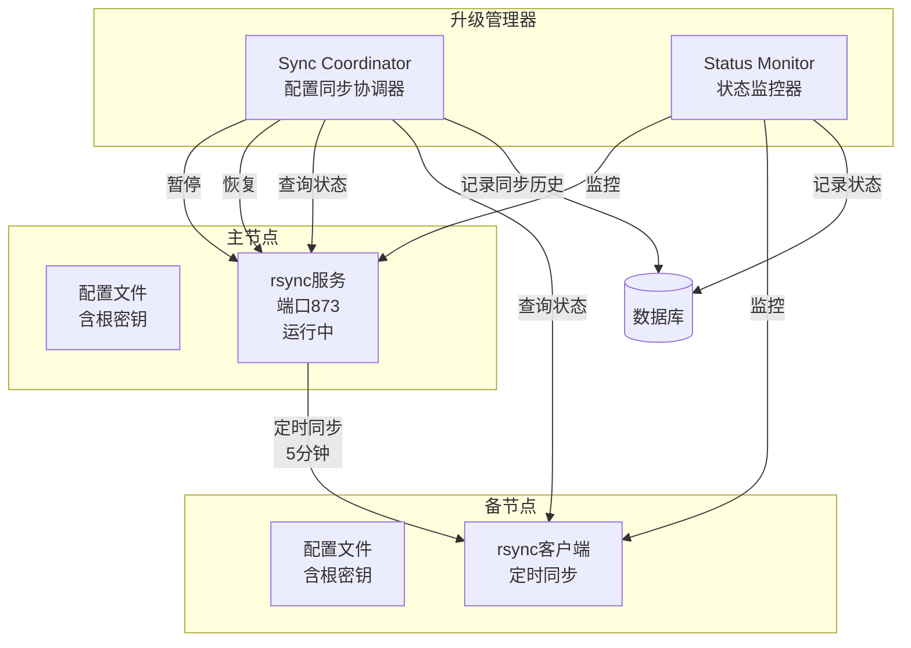
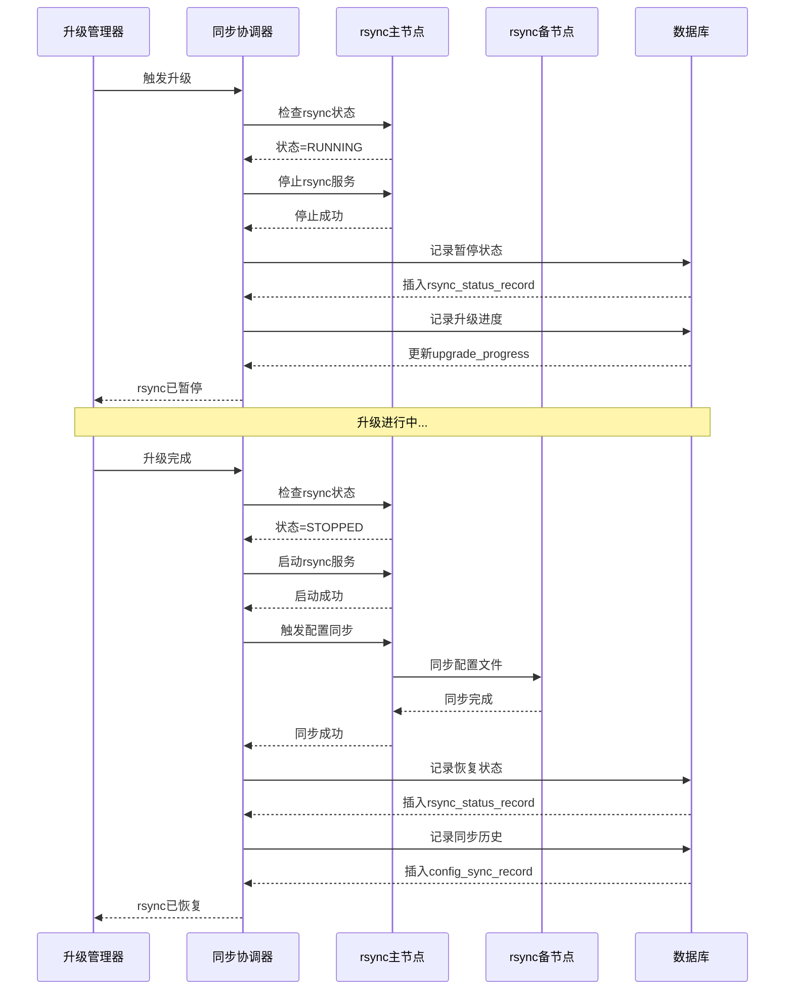
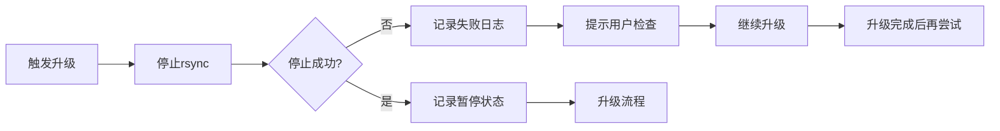
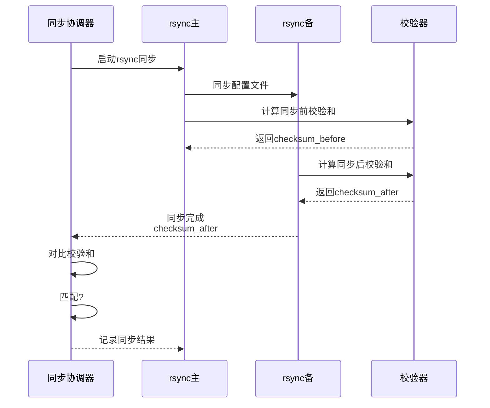
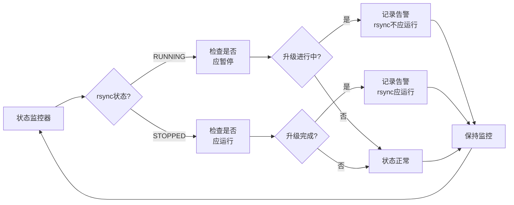
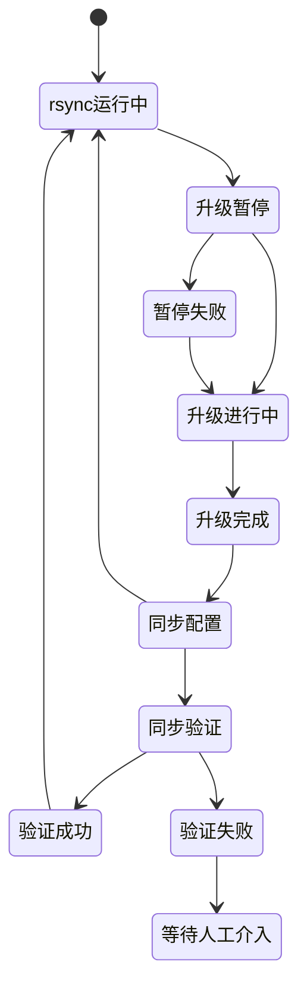

# 配置同步协调

## ADDED Requirements

### Requirement: 系统在升级触发后立即暂停 rsync 同步

系统 SHALL 在升级流程触发后立即暂停 rsync 同步服务，避免新版本配置被旧版本覆盖。

#### Scenario: 升级触发时暂停 rsync
- **WHEN** 升级管理器触发升级流程（准备阶段）
- **THEN** 系统 SHALL：
  1. 检测 rsync 服务是否运行
  2. 暂停 rsync 服务
  3. 记录 rsync 暂停时间和原因
  4. 验证 rsync 服务已停止
  5. 更新 upgrade_progress 表记录 "暂停 rsync" 步骤

#### Scenario: rsync 暂停失败
- **WHEN** rsync 服务停止失败或服务不存在
- **THEN** 系统 SHALL：
  1. 记录 rsync 暂停失败日志
  2. 提示用户检查 rsync 服务状态
  3. 继续升级流程（升级不依赖 rsync 暂停）
  4. 在升级完成后尝试再次停止 rsync

#### Scenario: 升级期间检测 rsync 启动
- **WHEN** 升级进行中，检测到 rsync 服务重新启动
- **THEN** 系统 SHALL：
  1. 立即记录 rsync 异常启动日志
  2. 提示告警：升级期间 rsync 不应运行
  3. 不自动停止 rsync，避免影响其他正常 rsync 任务

---

### Requirement: 系统在两个节点升级完成后恢复 rsync 同步

系统 SHALL 在两个节点都升级完成后恢复 rsync 同步服务，确保配置一致性。

#### Scenario: 升级完成后恢复 rsync
- **WHEN** 升级流程完成且两个节点都验证成功
- **THEN** 系统 SHALL：
  1. 启动 rsync 服务
  2. 验证 rsync 服务正常运行
  3. 记录 rsync 恢复时间和原因
  4. 更新 upgrade_progress 表记录 "恢复 rsync" 步骤
  5. 触发一次配置同步，确保两个节点配置一致

#### Scenario: rsync 恢复失败
- **WHEN** rsync 服务启动失败
- **THEN** 系统 SHALL：
  1. 记录 rsync 恢复失败日志
  2. 重试启动 rsync（最多 3 次）
  3. 如果仍失败，报错并提示手动处理
  4. 标记升级状态为部分成功（升级成功但 rsync 未恢复）

#### Scenario: 配置同步验证
- **WHEN** rsync 恢复后执行配置同步
- **THEN** 系统 SHALL：
  1. 等待 rsync 同步完成（超时 2 分钟）
  2. 对比两个节点的配置文件校验和
  3. 如果校验和不匹配，记录配置不一致告警
  4. 记录配置同步结果到 upgrade_progress 表

---

### Requirement: 系统避免新版本配置被旧版本覆盖

系统 SHALL 在升级暂停 rsync 期间确保新版本配置不被旧版本覆盖。

#### Scenario: 升级期间配置修改隔离
- **WHEN** rsync 暂停且升级进行中
- **THEN** 系统 SHALL：
  1. 锁定配置文件，防止外部修改
  2. 升级完成后写入新版本配置
  3. 确保 rsync 恢复时不会覆盖新配置

#### Scenario: 升级失败后的 rsync 恢复
- **WHEN** 升级失败且需要回滚
- **THEN** 系统 SHALL：
  1. 恢复旧版本配置文件（从备份）
  2. 恢复 rsync 同步
  3. 确保 rsync 同步的是旧版本配置
  4. 不执行配置同步，避免覆盖恢复的旧配置

#### Scenario: 配置文件冲突检测
- **WHEN** rsync 恢复时检测到配置文件冲突
- **THEN** 系统 SHALL：
  1. 记录配置冲突日志
  2. 告警提示用户手动解决冲突
  3. 暂停 rsync，等待人工介入

---

### Requirement: 系统支持查询 rsync 状态

系统 SHALL 提供接口查询 rsync 服务状态和同步历史。

#### Scenario: 查询 rsync 服务状态
- **WHEN** 系统管理员调用 rsync 状态查询接口
- **THEN** 系统 SHALL 返回：
  1. rsync 服务状态（RUNNING / STOPPED）
  2. 上次同步时间
  3. 同步频率（5 分钟）
  4. 是否被升级流程暂停
  5. 暂停或恢复的时间

#### Scenario: 查询配置同步历史
- **WHEN** 系统管理员查询配置同步历史
- **THEN** 系统 SHALL 返回：
  1. 最近 10 次配置同步记录
  2. 每次同步的源节点和目标节点
  3. 同步的文件列表
  4. 同步状态和耗时
  5. 同步失败的原因（如果有）

---

## 数据模型

### rsync 状态记录表（rsync_status_record）

| 字段名 | 类型 | 描述 | 约束 |
|--------|------|------|--------|
| status_id | BIGINT | 状态记录唯一标识 | PRIMARY KEY, AUTO_INCREMENT |
| node_type | VARCHAR(10) | 节点类型 | NOT NULL, VALUES ('MASTER', 'BACKUP') |
| node_ip | VARCHAR(50) | 节点 IP 地址 | NOT NULL |
| service_status | VARCHAR(20) | rsync 服务状态 | NOT NULL, VALUES ('RUNNING', 'STOPPED', 'UNKNOWN') |
| is_paused | BOOLEAN | 是否被升级流程暂停 | NOT NULL, DEFAULT FALSE |
| pause_time | DATETIME | 暂停时间 | NULLABLE |
| resume_time | DATETIME | 恢复时间 | NULLABLE |
| paused_reason | VARCHAR(200) | 暂停原因 | NULLABLE, VALUES ('UPGRADE', 'MANUAL') |
| check_time | DATETIME | 检查时间 | NOT NULL, DEFAULT CURRENT_TIMESTAMP |
| created_at | DATETIME | 记录创建时间 | NOT NULL, DEFAULT CURRENT_TIMESTAMP |

### 配置同步记录表（config_sync_record）

| 字段名 | 类型 | 描述 | 约束 |
|--------|------|------|--------|
| sync_id | BIGINT | 同步记录唯一标识 | PRIMARY KEY, AUTO_INCREMENT |
| upgrade_id | BIGINT | 关联的升级记录 ID | NULLABLE, FOREIGN KEY REFERENCES upgrade_history(upgrade_id) |
| from_node_ip | VARCHAR(50) | 源节点 IP（主节点） | NOT NULL |
| to_node_ip | VARCHAR(50) | 目标节点 IP（备节点） | NOT NULL |
| sync_time | DATETIME | 同步触发时间 | NOT NULL |
| sync_duration_seconds | INT | 同步耗时（秒） | NULLABLE |
| sync_status | VARCHAR(20) | 同步状态 | NOT NULL, VALUES ('SUCCESS', 'FAILED', 'PARTIAL', 'TIMEOUT') |
| files_synced | INT | 同步的文件数量 | NULLABLE |
| files_failed | INT | 失败的文件数量 | NULLABLE |
| checksum_before | VARCHAR(64) | 同步前的配置校验和 | NOT NULL |
| checksum_after | VARCHAR(64) | 同步后的配置校验和 | NOT NULL |
| error_message | TEXT | 同步失败错误消息 | NULLABLE |
| created_at | DATETIME | 记录创建时间 | NOT NULL, DEFAULT CURRENT_TIMESTAMP |

---

## 部署视图

---

## 运行视图

### rsync 暂停/恢复流程

### rsync 暂停失败处理流程

### 配置同步验证流程

### rsync 状态监控流程

### 配置同步协调状态机

