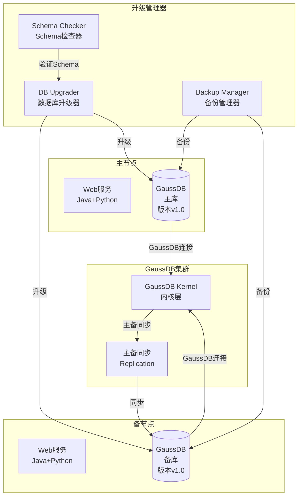
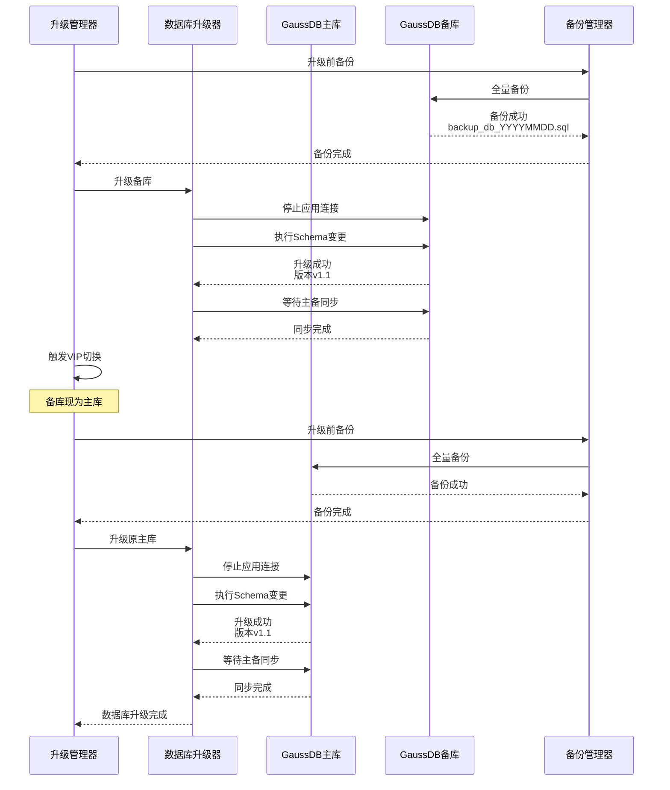
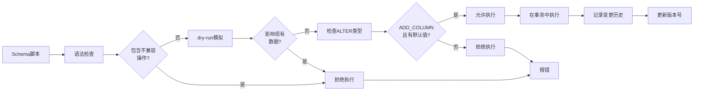
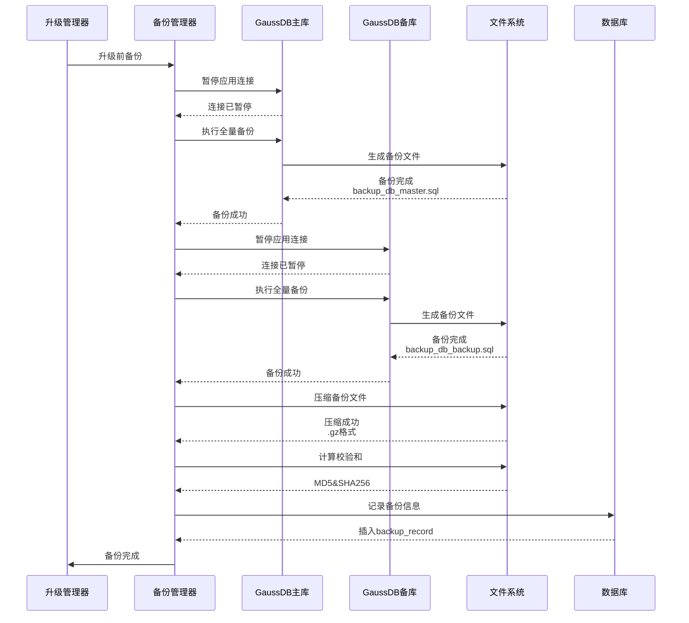
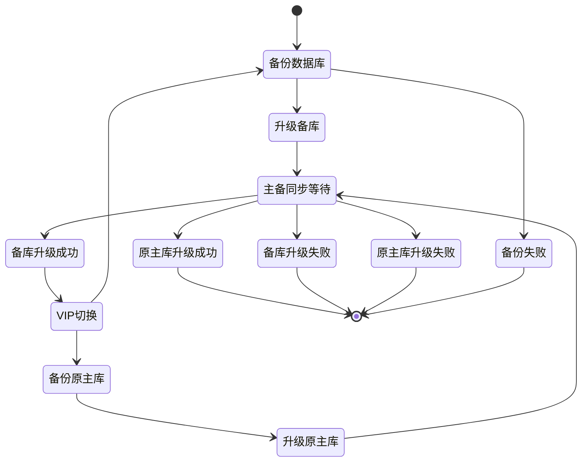
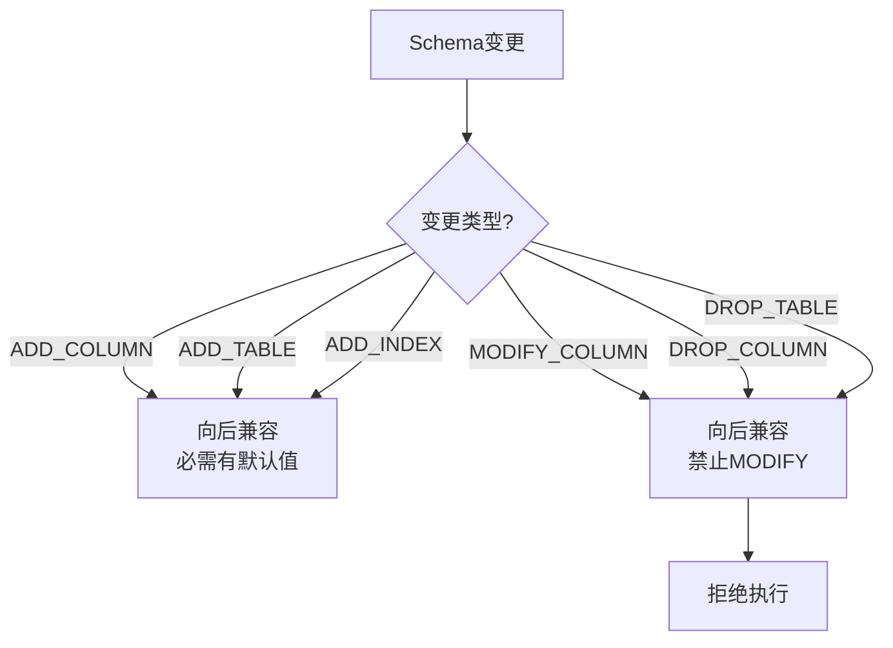

# 数据库升级管理

## ADDED Requirements

### Requirement: 系统支持 GaussDB 主备同步升级（先备后主）

系统 SHALL 按照先升级备节点 GaussDB，VIP 切换后再升级原主节点 GaussDB 的顺序执行升级。

#### Scenario: 成功的 GaussDB 主备升级
- **WHEN** 升级流程执行 GaussDB 升级阶段
- **THEN** 系统 SHALL：
  1. 先升级备节点 GaussDB（执行 schema 变更）
  2. 等待主备数据库同步完成
  3. 验证备节点数据库升级成功
  4. 触发 VIP 切换（备节点升为主）
  5. 升级原主节点（现已备节点）GaussDB
  6. 等待主备数据库同步完成
  7. 验证该节点数据库升级成功
  8. 记录数据库升级时间戳和版本信息

#### Scenario: 备节点数据库升级失败
- **WHEN** 备节点 GaussDB 升级失败（schema 变更执行失败）
- **THEN** 系统 SHALL：
  1. 立即停止升级流程
  2. 记录详细失败日志（SQL 错误、超时等）
  3. 不触发 VIP 切换
  4. VIP 保持在主节点，主节点数据库继续提供服务
  5. 报错并等待用户手动处理

#### Scenario: 原主节点（现已备节点）数据库升级失败
- **WHEN** 原 master 节点数据库升级失败
- **THEN** 系统 SHALL：
  1. 记录详细失败日志
  2. VIP 在新主节点（原备节点），数据库继续可用
  3. 报错并等待用户手动回滚该节点数据库
  4. 不影响新主节点的数据库服务

---

### Requirement: 系统支持 schema 变更，强制要求向后兼容

系统 SHALL 支持 GaussDB schema 变更，强制要求高版本 SQL 不能影响低版本正常运行。

#### Scenario: 向后兼容的 schema 变更
- **WHEN** 执行 schema 变更脚本
- **THEN** 系统 SHALL：
  1. 验证 SQL 脚本符合向后兼容规范
  2. 使用 `ALTER TABLE ADD COLUMN` 而非 `MODIFY` 或 `DROP`
  3. 新增字段设置默认值
  4. 新增字段设置为 NULLABLE 或有默认值
  5. 不删除或修改现有字段
  6. 记录 schema 变更历史

#### Scenario: schema 变更验证
- **WHEN** schema 变更脚本执行前
- **THEN** 系统 SHALL：
  1. 检查 SQL 脚本语法
  2. 模拟执行（dry-run）验证影响范围
  3. 检查是否包含向后兼容关键字（DROP, MODIFY, ALTER COLUMN SET NOT NULL）
  4. 如果包含不兼容操作，拒绝执行并报错

#### Scenario: schema 变更执行
- **WHEN** schema 变更验证通过
- **THEN** 系统 SHALL：
  1. 在事务中执行 schema 变更
  2. 记录执行时间和影响的表
  3. 验证事务提交成功
  4. 更新数据库版本号

---

### Requirement: 系统在升级前全量备份数据库

系统 SHALL 在升级 GaussDB 前执行全量数据库备份。

#### Scenario: 成功的数据库全量备份
- **WHEN** GaussDB 升级前准备阶段
- **THEN** 系统 SHALL：
  1. 停止应用数据库连接（避免备份期间数据变更）
  2. 执行数据库全量备份（mysqldump 或 GaussDB 备份工具）
  3. 压缩备份文件（gzip）
  4. 计算备份文件校验和（MD5, SHA256）
  5. 记录备份信息到 backup_record 表
  6. 验证备份文件完整性

#### Scenario: 数据库备份失败
- **WHEN** 数据库备份失败（空间不足、权限错误、连接失败）
- **THEN** 系统 SHALL：
  1. 记录详细失败日志
  2. 清理部分备份文件
  3. 立即停止升级流程
  4. 报错并提示用户检查数据库状态和磁盘空间

#### Scenario: 数据库备份校验和验证
- **WHEN** 数据库备份完成
- **THEN** 系统 SHALL：
  1. 验证备份文件大小合理（非空、非零）
  2. 计算并存储校验和
  3. 可选：验证备份文件可恢复（测试恢复）
  4. 记录备份元数据（表数量、数据量）

---

### Requirement: 系统支持数据库升级历史记录

系统 SHALL 记录数据库升级历史，包括 schema 变更、版本信息、执行时间。

#### Scenario: 记录数据库升级
- **WHEN** 数据库升级成功
- **THEN** 系统 SHALL 记录：
  1. 升级时间戳
  2. 升级前版本号
  3. 升级后版本号
  4. schema 变更脚本文件名
  5. 影响的表列表
  6. 升级节点（主/备）
  7. 升级状态（SUCCESS / FAILED）

#### Scenario: 查询数据库升级历史
- **WHEN** 系统管理员查询数据库升级历史
- **THEN** 系统 SHALL 返回：
  1. 最近 10 次数据库升级记录
  2. 每次升级的版本变更
  3. schema 变更影响范围
  4. 升级耗时和结果

---

## 数据模型

### 数据库升级记录表（database_upgrade_record）

| 字段名 | 类型 | 描述 | 约束 |
|--------|------|------|--------|
| upgrade_id | BIGINT | 升级记录唯一标识 | PRIMARY KEY, AUTO_INCREMENT |
| upgrade_time | DATETIME | 升级时间 | NOT NULL, DEFAULT CURRENT_TIMESTAMP |
| node_type | VARCHAR(10) | 节点类型 | NOT NULL, VALUES ('MASTER', 'BACKUP') |
| node_ip | VARCHAR(50) | 节点 IP 地址 | NOT NULL |
| version_before | VARCHAR(50) | 升级前版本号 | NOT NULL |
| version_after | VARCHAR(50) | 升级后版本号 | NULLABLE |
| schema_script_name | VARCHAR(200) | schema 变更脚本文件名 | NULLABLE |
| tables_affected | TEXT | 影响的表列表（JSON 数组） | NULLABLE |
| upgrade_status | VARCHAR(20) | 升级状态 | NOT NULL, VALUES ('SUCCESS', 'FAILED', 'TIMEOUT') |
| upgrade_duration_seconds | INT | 升级耗时（秒） | NULLABLE |
| error_message | TEXT | 失败错误消息 | NULLABLE |
| error_sql | TEXT | 失败的 SQL 语句 | NULLABLE |
| created_at | DATETIME | 记录创建时间 | NOT NULL, DEFAULT CURRENT_TIMESTAMP |

### Schema 变更历史表（schema_change_history）

| 字段名 | 类型 | 描述 | 约束 |
|--------|------|------|--------|
| change_id | BIGINT | 变更记录唯一标识 | PRIMARY KEY, AUTO_INCREMENT |
| upgrade_id | BIGINT | 关联的升级记录 ID | NOT NULL, FOREIGN KEY REFERENCES database_upgrade_record(upgrade_id) |
| change_time | DATETIME | 变更时间 | NOT NULL, DEFAULT CURRENT_TIMESTAMP |
| table_name | VARCHAR(100) | 变更的表名 | NOT NULL |
| change_type | VARCHAR(50) | 变更类型 | NOT NULL, VALUES ('ADD_COLUMN', 'ADD_TABLE', 'ADD_INDEX', 'MODIFY_COLUMN') |
| column_name | VARCHAR(100) | 变更的列名（仅对列变更） | NULLABLE |
| change_sql | TEXT | 变更的 SQL 语句 | NOT NULL |
| is_backward_compatible | BOOLEAN | 是否向后兼容 | NOT NULL, DEFAULT TRUE |
| rollback_sql | TEXT | 回滚 SQL 语句 | NULLABLE |
| created_at | DATETIME | 记录创建时间 | NOT NULL, DEFAULT CURRENT_TIMESTAMP |

---

## 部署视图

---

## 运行视图

### GaussDB 主备升级流程

### Schema 向后兼容验证流程

### 数据库备份流程

### 数据库升级状态机

### Schema 变更类型分类

