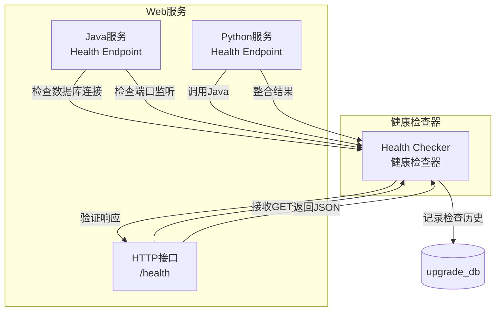
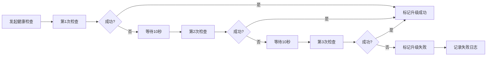

# 统一健康检查机制

## ADDED Requirements

### Requirement: 系统提供标准化的 /health HTTP 健康检查接口

系统 SHALL 在 Web 服务（Java + Python）中提供 /health HTTP 接口，用于检查服务运行状态。

#### Scenario: 成功的健康检查响应
- **WHEN** HTTP 客户端向 /health 接口发送 GET 请求
- **THEN** 系统 SHALL 返回：
  1. HTTP 状态码 200 OK
  2. JSON 格式的响应体，包含以下字段：
     - status: "UP" 或 "DOWN"
     - timestamp: 检查时间戳（ISO 8601 格式）
     - checks: 检查项详情对象数组

#### Scenario: 健康检查项详情
- **WHEN** /health 接口返回成功响应
- **THEN** checks 数组 SHALL 包含以下检查项：
  1. database: 数据库连接检查
     - name: "database"
     - status: "UP" 或 "DOWN"
     - message: 详细信息（连接成功/失败原因）
  2. port: 服务端口检查
     - name: "port"
     - status: "UP" 或 "DOWN"
     - message: 详细信息（端口监听/未监听）
  3. keepalived: Keepalived 心跳检查
     - name: "keepalived"
     - status: "UP" 或 "DOWN"
     - message: 详细信息（主/备状态、VIP 持有）

---

### Requirement: 健康检查支持数据库连接验证

系统 SHALL 在健康检查中验证数据库连接状态，确保 GaussDB 可访问。

#### Scenario: 数据库连接正常
- **WHEN** 数据库连接正常且可执行查询
- **THEN** 健康检查 SHALL 返回：
  - checks.database.status: "UP"
  - checks.database.message: "Database connection successful"

#### Scenario: 数据库连接失败
- **WHEN** 数据库连接失败或超时
- **THEN** 健康检查 SHALL 返回：
  - checks.database.status: "DOWN"
  - checks.database.message: 包含失败原因（连接超时/认证失败/数据库不可达）
  - 整体 status: "DOWN"

#### Scenario: 数据库连接超时
- **WHEN** 数据库连接超时（超过 30 秒）
- **THEN** 健康检查 SHALL：
  1. 返回 checks.database.status: "DOWN"
  2. 记录超时日志
  3. 整体 status: "DOWN"

---

### Requirement: 健康检查支持服务端口验证

系统 SHALL 在健康检查中验证服务端口监听状态，确保 Web 服务可访问。

#### Scenario: 服务端口正常监听
- **WHEN** Java 和 Python 服务端口正常监听
- **THEN** 健康检查 SHALL 返回：
  - checks.port.status: "UP"
  - checks.port.message: "Service ports are listening"
  - checks.port.ports: 包含监听的端口列表（例如：[8080, 9090]）

#### Scenario: 服务端口未监听
- **WHEN** Java 或 Python 服务端口未监听
- **THEN** 健康检查 SHALL 返回：
  - checks.port.status: "DOWN"
  - checks.port.message: "Service ports are not listening"
  - checks.port.ports: 包含未监听的端口
  - 整体 status: "DOWN"

---

### Requirement: 健康检查支持 Keepalived 心跳验证

系统 SHALL 在健康检查中验证 Keepalived 心跳状态，确保 VIP 状态正常。

#### Scenario: Keepalived 心跳正常
- **WHEN** Keepalived 服务运行正常且心跳检测通过
- **THEN** 健康检查 SHALL 返回：
  - checks.keepalived.status: "UP"
  - checks.keepalived.message: "Keepalived heartbeat normal"
  - checks.keepalived.role: 当前节点角色（"MASTER" 或 "BACKUP"）
  - checks.keepalived.vip_held: 是否持有 VIP（true/false）

#### Scenario: Keepalived 心跳异常
- **WHEN** Keepalived 心跳检测失败或服务未运行
- **THEN** 健康检查 SHALL 返回：
  - checks.keepalived.status: "DOWN"
  - checks.keepalived.message: 包含失败原因（服务未运行/心跳超时）
  - 整体 status: "DOWN"

---

### Requirement: 健康检查自动判断升级成功

系统 SHALL 基于健康检查结果自动判断升级是否成功，无需人工验证。

#### Scenario: 升级成功的判断
- **WHEN** 升级完成后，健康检查连续 3 次返回所有检查项状态为 "UP"
- **THEN** 系统 SHALL：
  1. 标记升级状态为 "SUCCESS"
  2. 记录升级完成时间
  3. 更新 upgrade_history 表的 end_time 和 status
  4. 恢复 rsync 同步

#### Scenario: 升级失败的判断
- **WHEN** 健康检查超时（超过 30 秒未返回）或返回任一检查项状态为 "DOWN"
- **THEN** 系统 SHALL：
  1. 标记升级状态为 "FAILED"
  2. 记录失败原因到 upgrade_history 表
  3. 不触发自动回滚，等待用户手动处理
  4. 提供 upgrade_progress 接口查询失败详情

#### Scenario: 健康检查重试机制
- **WHEN** 第一次健康检查失败（返回部分检查项 "DOWN"）
- **THEN** 系统 SHALL：
  1. 等待 10 秒后重试
  2. 最多重试 3 次
  3. 如果所有重试都失败，标记升级失败
  4. 记录每次重试的结果到 upgrade_progress 表

---

### Requirement: 健康检查超时配置

系统 SHALL 支持配置健康检查超时时间，避免健康检查自身耗时过长。

#### Scenario: 配置健康检查超时时间
- **WHEN** 系统初始化时读取 upgrade_config 表
- **THEN** 系统 SHALL 加载 health_check.timeout_seconds 配置项（默认 30 秒）

#### Scenario: 健康检查超时
- **WHEN** 健康检查执行超过配置的超时时间
- **THEN** 系统 SHALL：
  1. 终止健康检查
  2. 返回 status: "TIMEOUT"
  3. 记录超时日志
  4. 按升级失败处理

---

## 数据模型

### 健康检查记录表（health_check_record）

| 字段名 | 类型 | 描述 | 约束 |
|--------|------|------|--------|
| check_id | BIGINT | 检查记录唯一标识 | PRIMARY KEY, AUTO_INCREMENT |
| check_time | DATETIME | 检查时间 | NOT NULL, DEFAULT CURRENT_TIMESTAMP |
| node_type | VARCHAR(10) | 节点类型 | NOT NULL, VALUES (MASTER, BACKUP) |
| overall_status | VARCHAR(20) | 整体状态 | NOT NULL, VALUES (UP, DOWN, TIMEOUT) |
| database_status | VARCHAR(20) | 数据库检查状态 | NOT NULL, VALUES (UP, DOWN, TIMEOUT) |
| database_message | TEXT | 数据库检查消息 | NULLABLE |
| port_status | VARCHAR(20) | 端口检查状态 | NOT NULL, VALUES (UP, DOWN) |
| port_message | TEXT | 端口检查消息 | NULLABLE |
| keepalived_status | VARCHAR(20) | Keepalived 检查状态 | NOT NULL, VALUES (UP, DOWN) |
| keepalived_role | VARCHAR(20) | Keepalived 角色 | NULLABLE, VALUES (MASTER, BACKUP) |
| keepalived_vip_held | BOOLEAN | 是否持有 VIP | NULLABLE |
| response_time_ms | INT | 响应时间（毫秒） | NULLABLE |

---

## 部署视图

### 健康检查器部署



---

## 运行视图

### 健康检查执行流程

```mermaid
sequenceDiagram
    participant 升级管理器
    participant Health Checker
    participant /health接口
    participant 数据库

    升级管理器->>Health Checker: 发起健康检查
    Health Checker->>/health接口: GET /health
    /health接口-->>Health Checker: 200 OK
    Health Checker->>Health Checker: 验证响应
    Health Checker->>数据库: 记录检查历史
    数据库-->>Health Checker: 插入health_check_record
    Health Checker-->>升级管理器: 检查成功
```

### 健康检查重试流程



### 健康检查接口响应示例

**成功响应（HTTP 200）**：
\`\`\`json
{
  "status": "UP",
  "timestamp": "2025-01-07T15:30:00Z",
  "response_time_ms": 45,
  "checks": [
    {
      "name": "database",
      "status": "UP",
      "message": "Database connection successful"
    },
    {
      "name": "port",
      "status": "UP",
      "message": "Service ports are listening",
      "ports": [8080, 9090]
    },
    {
      "name": "keepalived",
      "status": "UP",
      "message": "Keepalived heartbeat normal",
      "role": "MASTER",
      "vip_held": true
    }
  ]
}
\`\`\`

**失败响应（HTTP 500）**：
\`\`\`json
{
  "status": "DOWN",
  "timestamp": "2025-01-07T15:31:00Z",
  "checks": [
    {
      "name": "database",
      "status": "DOWN",
      "message": "Connection timeout after 30 seconds"
    },
    {
      "name": "port",
      "status": "UP",
      "message": "Service ports are listening",
      "ports": [8080, 9090]
    },
    {
      "name": "keepalived",
      "status": "UP",
      "message": "Keepalived heartbeat normal",
      "role": "MASTER",
      "vip_held": true
    }
  ]
}
\`\`\`

**超时响应（HTTP 408）**：
\`\`\`json
{
  "status": "TIMEOUT",
  "timestamp": "2025-01-07T15:32:00Z",
  "message": "Health check timeout after 30 seconds"
}
\`\`\`
