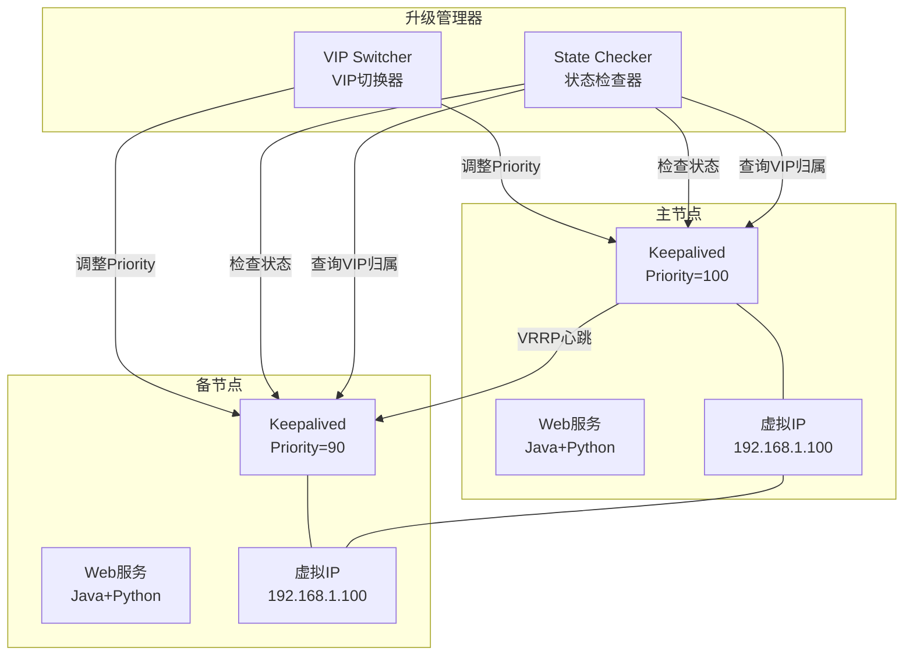
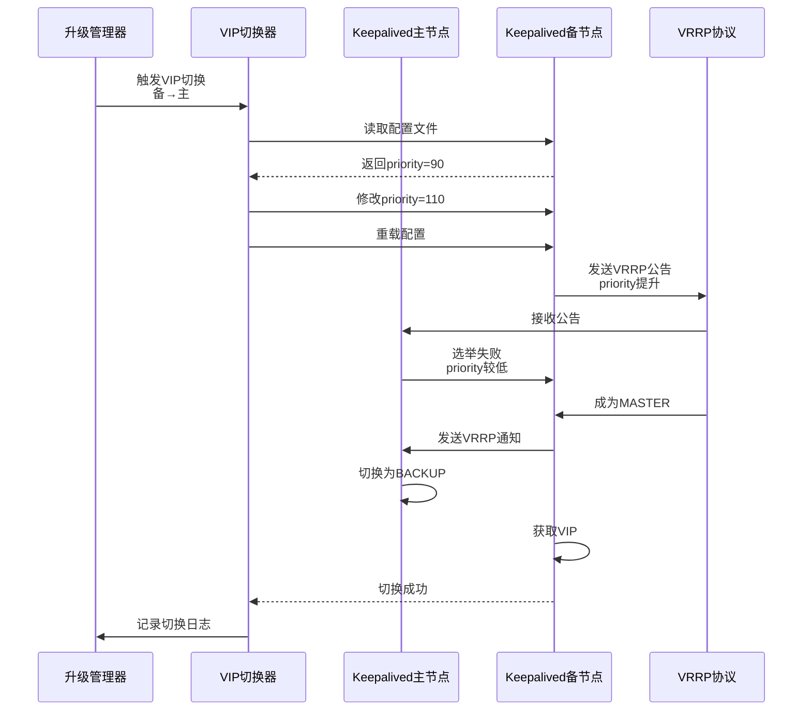
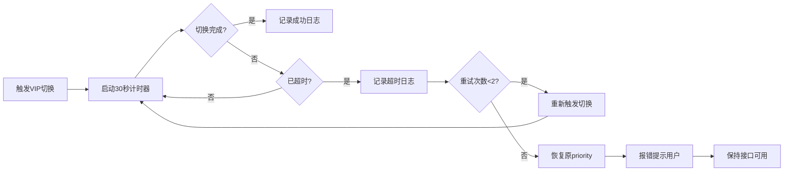
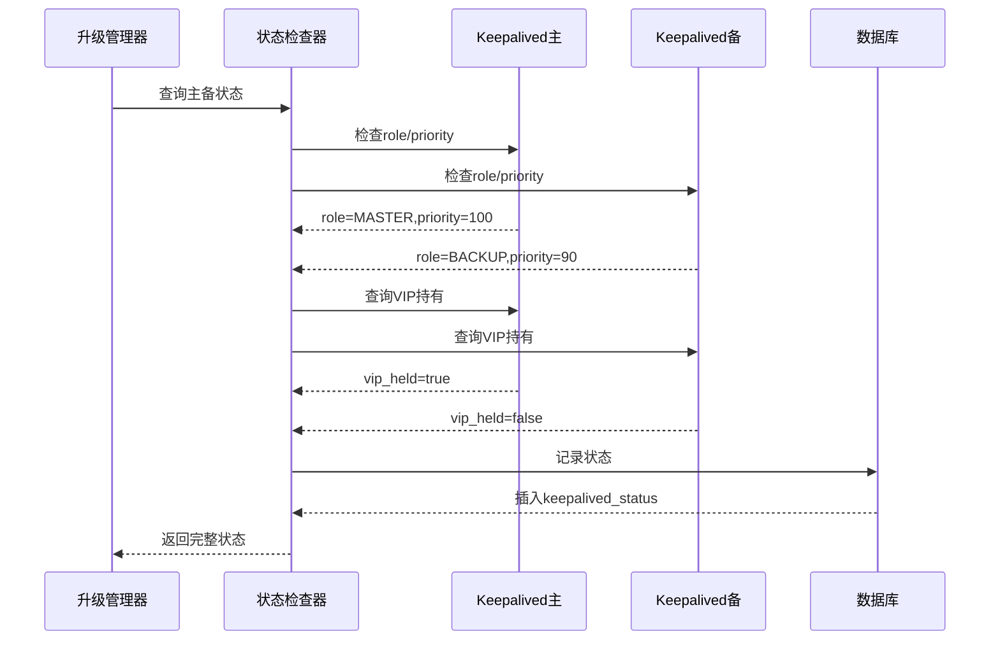
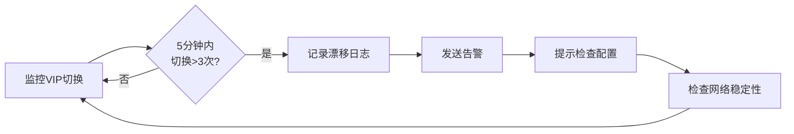
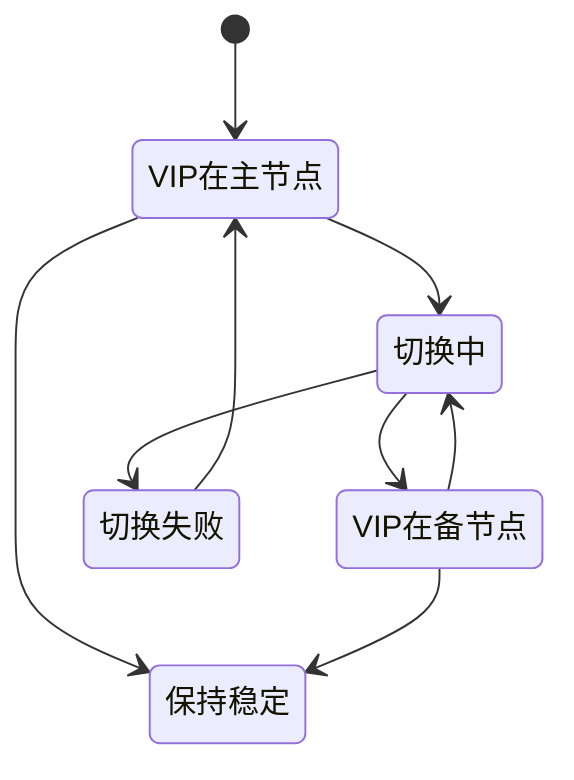

# VIP 切换控制

## ADDED Requirements

### Requirement: 系统支持通过调整 Keepalived priority 实现手动触发 VIP 切换

系统 SHALL 通过动态调整 Keepalived 配置的 priority 值来手动触发 VIP 切换。

#### Scenario: 成功的 VIP 切换（备节点升为主）
- **WHEN** 升级管理器提升备节点 priority > 主节点
- **THEN** 系统 SHALL：
  1. 读取备节点 Keepalived 配置文件
  2. 修改 `priority` 值为 110（原主节点为 100）
  3. 重载 Keepalived 配置
  4. 等待 VRRP 协议完成切换（超时 30 秒）
  5. 验证 VIP 现在在备节点
  6. 记录 VIP 切换成功日志

#### Scenario: VIP 切换超时
- **WHEN** VIP 切换超过 30 秒未完成
- **THEN** 系统 SHALL：
  1. 记录 VIP 切换超时日志
  2. 检查 Keepalived 服务状态
  3. 尝试重新触发切换（最多 2 次重试）
  4. 如果仍超时，报错并保持当前主备状态

#### Scenario: VIP 切换失败
- **WHEN** Keepalived 服务异常或配置错误导致切换失败
- **THEN** 系统 SHALL：
  1. 记录 VIP 切换失败日志和错误堆栈
  2. 恢复原 priority 配置
  3. 报错并提示用户手动检查 Keepalived 配置
  4. 保持接口可用，以供回退接口调用

---

### Requirement: 系统在升级失败时保持接口可用，以供回退接口调用

系统 SHALL 在升级失败时保持回退接口的可用性，确保系统可恢复。

#### Scenario: 升级失败后的接口可用性
- **WHEN** 升级失败或超时
- **THEN** 系统 SHALL：
  1. 保持 VIP 在稳定的主节点
  2. 确保 /health 接口可访问
  3. 确保回滚触发接口可用
  4. 确保升级进度查询接口可用
  5. 不停止任何服务或关闭网络端口

#### Scenario: 回退接口响应
- **WHEN** 用户调用回退接口
- **THEN** 系统 SHALL：
  1. 验证备份文件存在
  2. 启动回滚流程
  3. 实时返回回滚进度
  4. 回滚完成后返回成功状态

---

### Requirement: 系统配置 VIP 切换超时为 30 秒

系统 SHALL 支持配置 VIP 切换超时时间，默认为 30 秒。

#### Scenario: 配置 VIP 切换超时
- **WHEN** 系统初始化时读取 upgrade_config 表
- **THEN** 系统 SHALL 加载 `vip_switch.timeout_seconds` 配置项（默认 30 秒）

#### Scenario: VIP 切换超时触发
- **WHEN** VIP 切换等待时间超过配置的超时值
- **THEN** 系统 SHALL：
  1. 记录超时日志
  2. 执行超时处理逻辑（重试或报错）
  3. 更新 upgrade_progress 表记录超时状态

#### Scenario: 调整 VIP 切换超时配置
- **WHEN** 用户修改 upgrade_config 表的 `vip_switch.timeout_seconds`
- **THEN** 系统 SHALL：
  1. 验证新值在合理范围内（10-300 秒）
  2. 更新配置记录
  3. 记录配置变更日志

---

### Requirement: 系统支持查询当前主备节点状态

系统 SHALL 提供接口查询当前主备节点状态和 VIP 持有情况。

#### Scenario: 查询主备节点状态
- **WHEN** 系统管理员调用状态查询接口
- **THEN** 系统 SHALL 返回：
  1. 主节点 IP 和角色（MASTER）
  2. 备节点 IP 和角色（BACKUP）
  3. VIP 当前归属（持有 VIP 的节点）
  4. 各节点的 priority 值
  5. Keepalived 服务状态

#### Scenario: VIP 漂移检测
- **WHEN** VIP 在两个节点间频繁切换（漂移）
- **THEN** 系统 SHALL：
  1. 记录 VIP 漂移日志
  2. 告警提示网络或配置问题
  3. 建议检查 Keepalived 配置和网络稳定性

---

## 数据模型

### VIP 切换记录表（vip_switch_record）

| 字段名 | 类型 | 描述 | 约束 |
|--------|------|------|--------|
| switch_id | BIGINT | 切换记录唯一标识 | PRIMARY KEY, AUTO_INCREMENT |
| switch_time | DATETIME | 切换触发时间 | NOT NULL, DEFAULT CURRENT_TIMESTAMP |
| upgrade_id | BIGINT | 关联的升级记录 ID | NULLABLE, FOREIGN KEY REFERENCES upgrade_history(upgrade_id) |
| from_node_ip | VARCHAR(50) | 切换前持有 VIP 的节点 IP | NOT NULL |
| to_node_ip | VARCHAR(50) | 切换后持有 VIP 的节点 IP | NOT NULL |
| from_role | VARCHAR(20) | 切换前的角色 | NOT NULL, VALUES ('MASTER', 'BACKUP') |
| to_role | VARCHAR(20) | 切换后的角色 | NOT NULL, VALUES ('MASTER', 'BACKUP') |
| from_priority | INT | 切换前的 priority 值 | NOT NULL |
| to_priority | INT | 切换后的 priority 值 | NOT NULL |
| switch_status | VARCHAR(20) | 切换状态 | NOT NULL, VALUES ('SUCCESS', 'FAILED', 'TIMEOUT') |
| switch_duration_seconds | INT | 切换耗时（秒） | NULLABLE |
| error_message | TEXT | 失败错误消息 | NULLABLE |
| created_at | DATETIME | 记录创建时间 | NOT NULL, DEFAULT CURRENT_TIMESTAMP |

### Keepalived 状态记录表（keepalived_status）

| 字段名 | 类型 | 描述 | 约束 |
|--------|------|------|--------|
| status_id | BIGINT | 状态记录唯一标识 | PRIMARY KEY, AUTO_INCREMENT |
| node_type | VARCHAR(10) | 节点类型 | NOT NULL, VALUES ('MASTER', 'BACKUP') |
| node_ip | VARCHAR(50) | 节点 IP 地址 | NOT NULL |
| role | VARCHAR(20) | 当前角色 | NOT NULL, VALUES ('MASTER', 'BACKUP') |
| priority | INT | 当前 priority 值 | NOT NULL |
| vip_held | BOOLEAN | 是否持有 VIP | NOT NULL |
| vrrp_state | VARCHAR(50) | VRRP 协议状态 | NULLABLE |
| last_transition_time | DATETIME | 上次状态切换时间 | NULLABLE |
| check_time | DATETIME | 检查时间 | NOT NULL, DEFAULT CURRENT_TIMESTAMP |
| created_at | DATETIME | 记录创建时间 | NOT NULL, DEFAULT CURRENT_TIMESTAMP |

---

## 部署视图

---

## 运行视图

### VIP 切换流程

### VIP 切换超时处理流程

### 状态检查流程

### VIP 漂移检测流程

### 主备切换状态机

