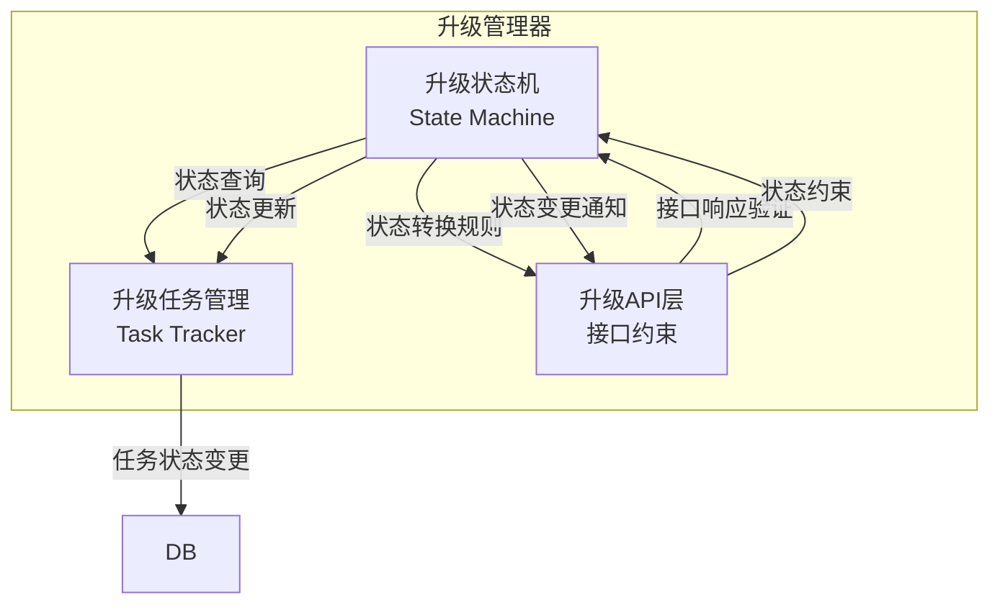
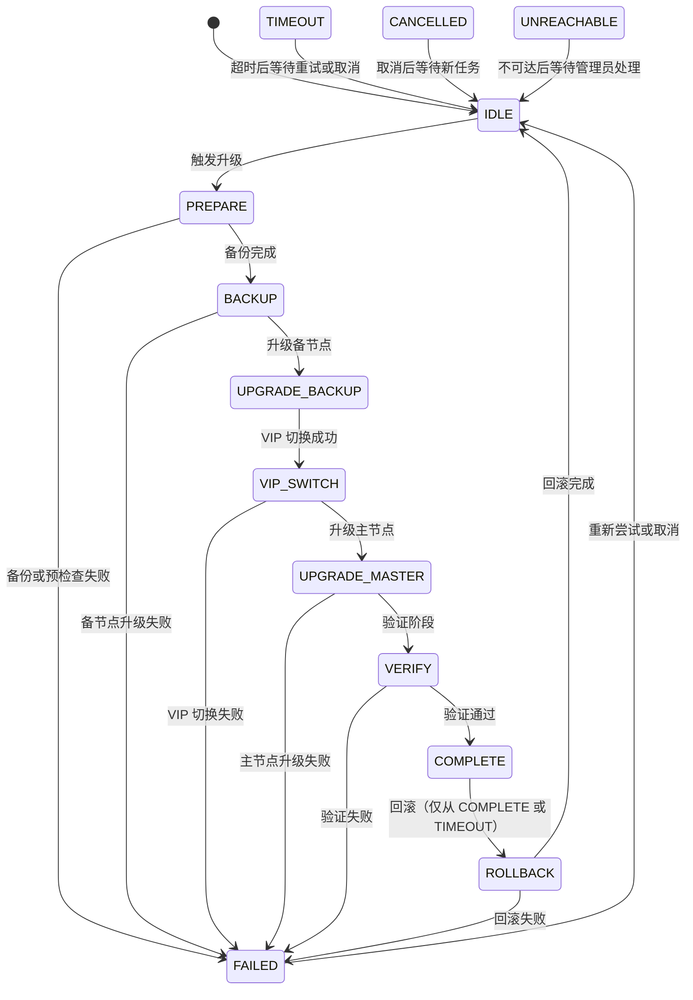
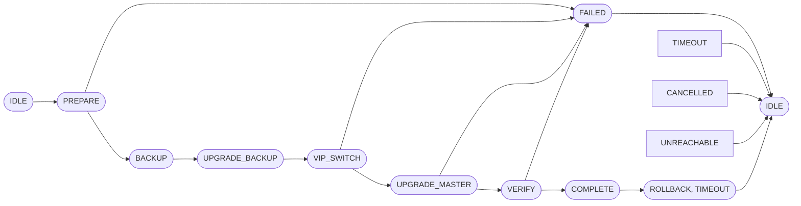
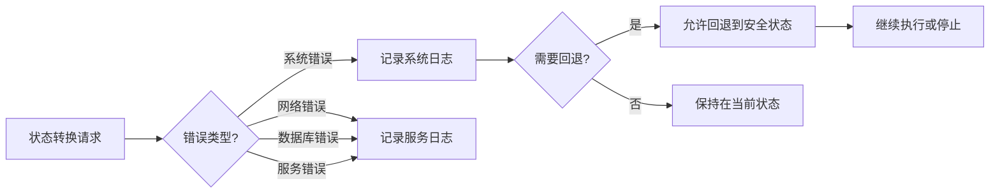
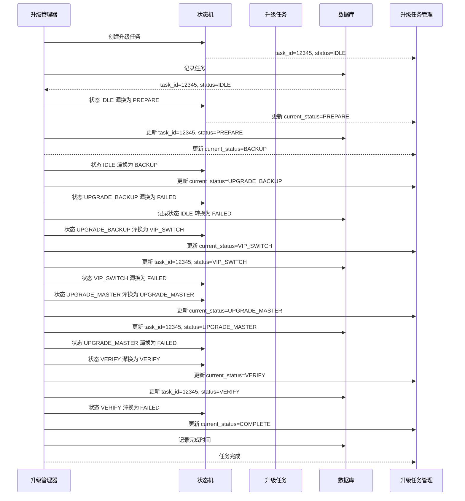
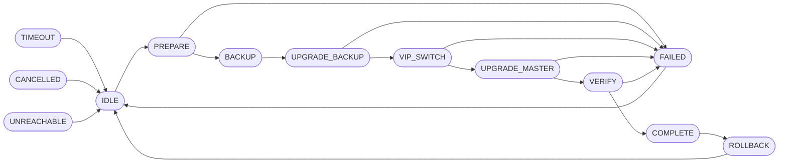

# 升级状态机

## ADDED Requirements

### Requirement: 系统定义统一的升级状态机

系统 SHALL 定义完整的升级状态机，约束系统在升级过程中的状态转换逻辑，确保升级流程的可靠性和可追溯性。

#### Scenario: 初始状态到准备阶段
- **WHEN** 系统空闲，无升级任务
- **THEN** 系统 SHALL：
  1. 从 IDLE 状态转换到 PREPARE 状态
  2. 触发备份流程
  3. 记录状态转换日志

#### Scenario: 准备阶段到备份阶段
- **WHEN** 备份完成且预检查通过
- **THEN** 系统 SHALL：
  1. 从 PREPARE 状态转换到 BACKUP 状态
  2. 记录状态转换日志（时间戳、原因）

#### Scenario: 备份阶段到升级备节点
- **WHEN** 备份完成，开始升级备节点
- **THEN** 系统 SHALL：
  1. 从 BACKUP 状态转换到 UPGRADE_BACKUP 状态
  2. 记录状态转换日志

#### Scenario: 备节点升级成功
- **WHEN** 备节点升级完成且健康检查通过
- **THEN** 系统 SHALL：
  1. 从 UPGRADE_BACKUP 状态转换到 VIP_SWITCH 状态
  2. 触发 VIP 切换

#### Scenario: VIP 切换成功
- **WHEN** VIP 切换完成且 VIP 现在原备节点（现主节点）
- **THEN** 系统 SHALL：
  1. 从 VIP_SWITCH 状态转换到 UPGRADE_MASTER 状态
  2. 记录状态转换日志

#### Scenario: 主节点升级成功
- **WHEN** 主节点升级完成且健康检查通过
- **THEN** 系统 SHALL：
  1. 从 UPGRADE_MASTER 状态转换到 VERIFY 状态
  2. 执行健康检查验证
  3. 记录状态转换日志

#### Scenario: 验证通过
- **WHEN** 两个节点都升级成功且健康检查全部通过
- **THEN** 系统 SHALL：
  1. 从 VERIFY 状态转换到 COMPLETE 状态
  2. 恢复 rsync 同步
  3. 记录升级完成时间

#### Scenario: 升级失败
- **WHEN** 升级过程中发生任何失败
- **THEN** 系统 SHALL：
  1. 从当前状态转换到 FAILED 状态
  2. 记录失败原因（错误类型、错误消息）
  3. 停止升级流程
  4. 保持接口可用
  5. 不触发自动回滚

#### Scenario: 升级超时
- **WHEN** 升级任务执行超过配置的超时时间
- **THEN** 系统 SHALL：
  1. 从当前状态转换到 TIMEOUT 状态
  2. 记录超时日志
  3. 提供恢复建议（重试/回滚）
  4. 保持接口可用

#### Scenario: 回滚触发
- **WHEN** 用户通过 API 触发回滚操作
- **THEN** 系统 SHALL：
  1. 从当前状态转换到 ROLLBACK 状态
  2. 停止当前升级流程
  3. 执行回滚操作
  4. 记录回滚日志

#### Scenario: 回滚完成
- **WHEN** 回滚操作执行成功且健康检查通过
- **THEN** 系统 SHALL：
  1. 从 ROLLBACK 状态转换到 IDLE 状态
  2. 记录回滚完成时间

#### Scenario: 升级取消
- **WHEN** 管理员通过 API 取消正在进行的升级任务
- **THEN** 系统 SHALL：
  1. 从当前状态转换到 CANCELLED 状态
  2. 停止升级流程
  3. 清理临时文件
  4. 恢复 rsync 同步
  5. 记录取消时间和原因

#### Scenario: 节点不可达
- **WHEN** 系统无法连接到某个节点（SSH 连接失败、节点宕机等）
- **THEN** 系统 SHALL：
  1. 从当前状态转换到 UNREACHABLE 状态
  2. 记录不可达原因（网络异常、节点宕机）
  3. 停止升级流程
  4. 告警通知管理员
  5. 保持接口可用

---

### Requirement: 状态机约束和验证规则

系统 SHALL 定义明确的状态转换约束，防止非法状态转换。

#### Scenario: 状态转换验证
- **WHEN** 发生状态转换
- **THEN** 系统 SHALL：
  1. 验证状态转换是否符合规则（不允许非法转换）
  2. 如果合法，允许转换
  3. 如果非法，拒绝转换并记录错误日志
  4. 更新 upgrade_task 表的 current_status 字段
  5. 记录状态转换时间和原因
  6. 通知相关组件（如 api-interfaces）状态变更

#### Scenario: 获取升级任务状态
- **WHEN** 查询升级任务状态
- **THEN** 系统 SHALL：
  1. 返回 upgrade_task 表的完整信息
  2. 包含任务 ID、当前状态、当前阶段、进度百分比

---

## 数据模型

### 升级任务表（upgrade_task）

| 字段名 | 类型 | 描述 | 约束 |
|--------|------|------|--------|
| task_id | BIGINT | 任务唯一标识 | PRIMARY KEY, AUTO_INCREMENT |
| task_type | VARCHAR(20) | 任务类型 | NOT NULL, VALUES ('UPGRADE', 'ROLLBACK', 'CANCEL') |
| current_status | VARCHAR(20) | 当前状态 | NOT NULL, VALUES ('IDLE', 'PREPARE', 'BACKUP', 'UPGRADE_BACKUP', 'VIP_SWITCH', 'UPGRADE_MASTER', 'VERIFY', 'COMPLETE', 'ROLLBACK', 'CANCELLED', 'FAILED', 'TIMEOUT', 'UNREACHABLE') |
| previous_status | VARCHAR(20) | 上一状态 | NULLABLE |
| status_change_reason | VARCHAR(200) | 状态变更原因 | NULLABLE |
| current_phase | VARCHAR(50) | 当前阶段 | NULLABLE, VALUES ('PREPARE', 'BACKUP', 'UPGRADE_BACKUP', 'VIP_SWITCH', 'UPGRADE_MASTER', 'VERIFY', 'COMPLETE', 'ROLLBACK', 'CANCELLED', 'FAILED', 'TIMEOUT', 'UNREACHABLE') |
| progress_percentage | INT | 进度百分比（0-100） | NULLABLE |
| error_type | VARCHAR(50) | 错误类型 | NULLABLE, VALUES ('SYSTEM', 'NETWORK', 'DATABASE', 'SERVICE', 'TIMEOUT', 'USER_CANCEL') |
| error_message | TEXT | 错误消息 | NULLABLE |
| start_time | DATETIME | 开始时间 | NOT NULL, DEFAULT CURRENT_TIMESTAMP |
| end_time | DATETIME | 结束时间 | NULLABLE |
| created_at | DATETIME | 创建时间 | NOT NULL, DEFAULT CURRENT_TIMESTAMP |
| updated_at | DATETIME | 更新时间 | NOT NULL, DEFAULT CURRENT_TIMESTAMP ON UPDATE CURRENT_TIMESTAMP |

### 状态转换历史表（state_transition_history）

| 字段名 | 类型 | 描述 | 约束 |
|--------|------|------|--------|
| transition_id | BIGINT | 转换记录唯一标识 | PRIMARY KEY, AUTO_INCREMENT |
| task_id | BIGINT | 关联的升级任务 ID | NOT NULL, FOREIGN KEY REFERENCES upgrade_task(task_id) |
| from_status | VARCHAR(20) | 源状态 | NOT NULL |
| to_status | VARCHAR(20) | 目标状态 | NOT NULL |
| transition_reason | TEXT | 转换原因 | NULLABLE |
| transition_time | DATETIME | 转换时间 | NOT NULL, DEFAULT CURRENT_TIMESTAMP |
| created_at | DATETIME | 记录创建时间 | NOT NULL, DEFAULT CURRENT_TIMESTAMP |

---

## 部署视图

### 状态机组件部署

---

## 运行视图

### 状态机

### 状态转换规则

### 错误处理流程

### 状态转换时序图

### 最终状态转换路径

**状态转换说明：**
- **FAILED**: 可从任何状态进入
- **TIMEOUT**: 可从 IN_PROGRESS 状态进入
- **CANCELLED**: 可从任何 IN_PROGRESS 状态进入
- **ROLLBACK**: 仅从 COMPLETE 或 TIMEOUT 状态进入
