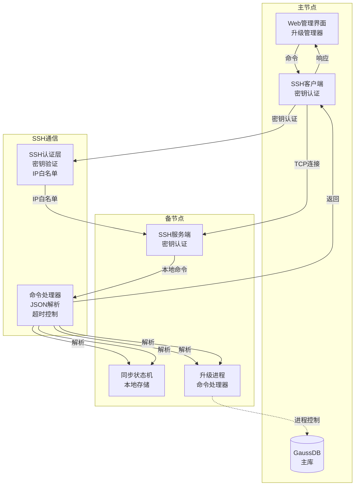
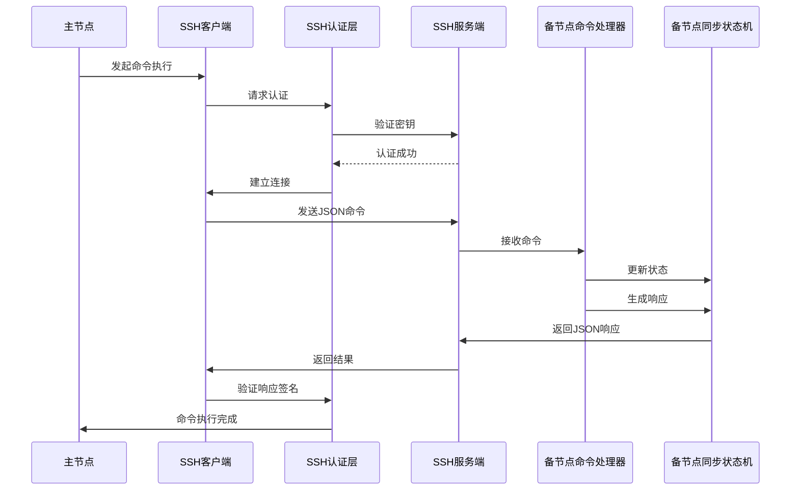
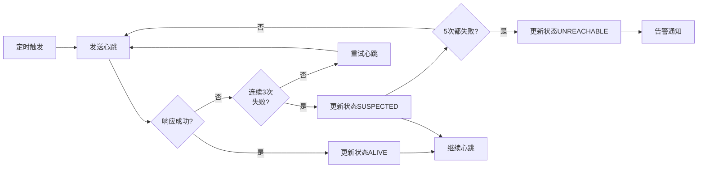
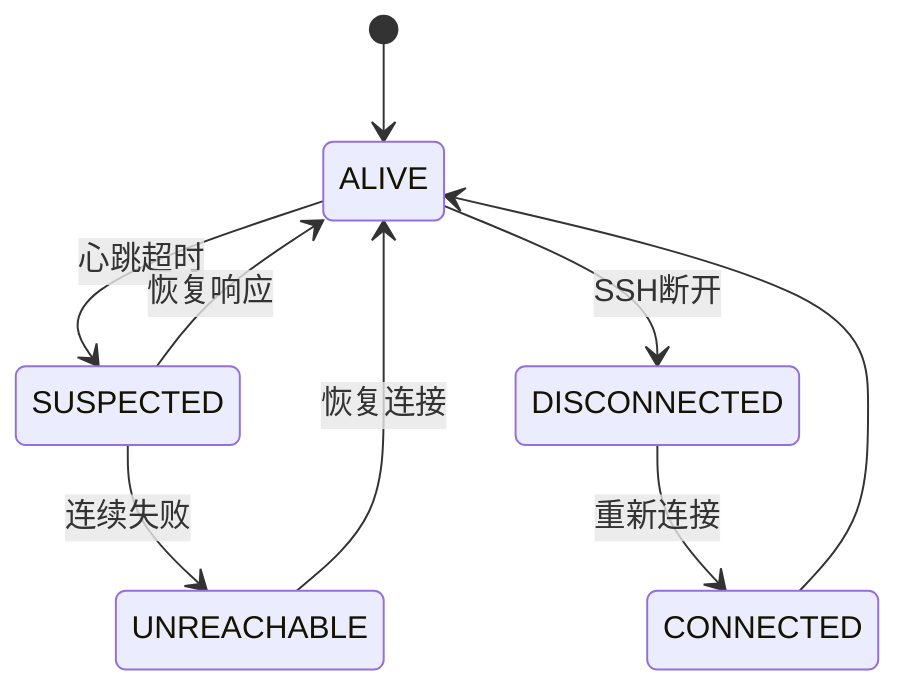
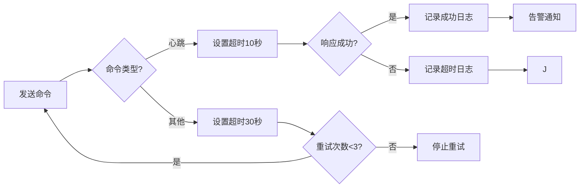
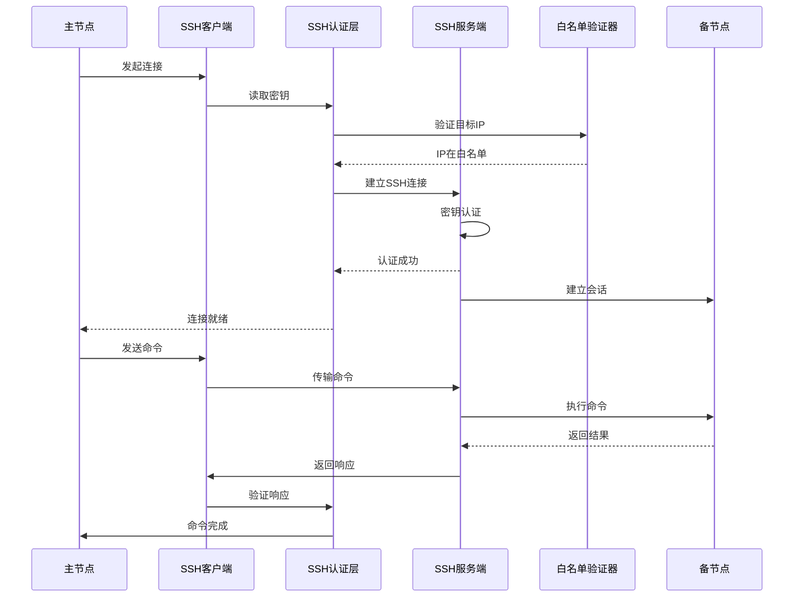
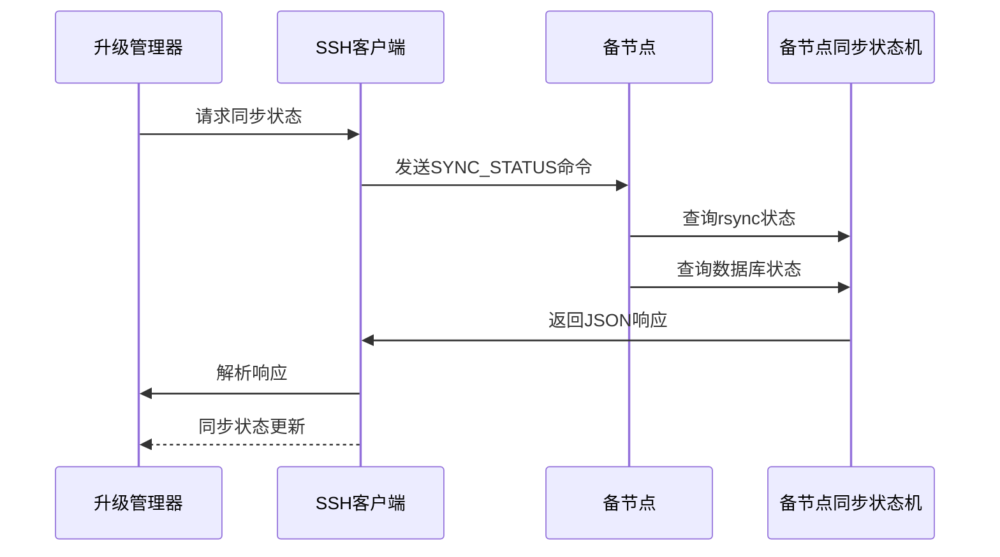
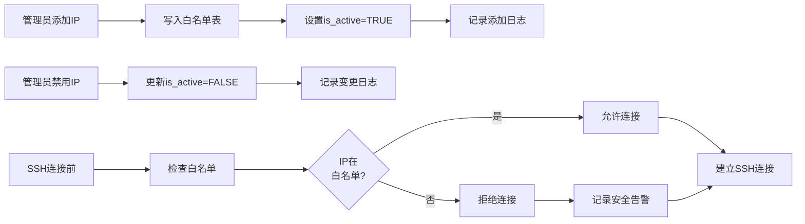

# 主备节点间通信管理

## ADDED Requirements

### Requirement: 系统支持基于 SSH 协议的主备节点间通信

系统 SHALL 使用 SSH 协议实现主备节点间的命令传递和状态同步，因为备节点没有 Web 服务，无法使用 REST 接口。

#### Scenario: 成功的 SSH 命令执行
- **WHEN** 主节点或升级管理器通过 SSH 向备节点发送命令
- **THEN** 系统 SHALL：
  1. 使用 SSH 密钥认证连接备节点
  2. 验证备节点 IP 在白名单中
  3. 发送 JSON 格式的命令
  4. 等待命令执行完成（默认超时 30 秒）
  5. 验证返回结果的签名
  6. 记录命令执行日志

#### Scenario: SSH 连接失败
- **WHEN** SSH 连接超时或认证失败
- **THEN** 系统 SHALL：
  1. 记录连接失败日志（原因：超时/认证失败/IP不在白名单）
  2. 重试连接（最多 3 次，每次间隔 10 秒）
  3. 如果所有重试都失败，标记节点通信状态为 UNREACHABLE
  4. 告警提示用户检查网络连接和 SSH 密钥

#### Scenario: 命令执行超时
- **WHEN** 命令执行超过配置的超时时间
- **THEN** 系统 SHALL：
  1. 终止命令执行
  2. 记录超时日志
  3. 返回超时错误状态
  4. 不重试执行，等待主节点决策

#### Scenario: 命令执行失败
- **WHEN** 命令执行失败或返回错误状态码
- **THEN** 系统 SHALL：
  1. 记录失败日志（错误状态码、错误消息）
  2. 解析错误原因并分类
  3. 返回详细的失败信息给主节点

---

### Requirement: 系统支持 JSON 格式的命令协议

系统 SHALL 使用标准化的 JSON 格式定义 SSH 命令，确保可解析和可扩展。

#### Scenario: 同步状态命令
- **WHEN** 主节点需要查询备节点同步状态
- **THEN** 系统 SHALL 发送以下 JSON 命令：
  ```json
  {
    "command": "SYNC_STATUS",
    "params": {
      "sync_types": ["rsync", "config", "database"]
    }
  }
  ```
  备节点 SHALL 返回当前同步状态

#### Scenario: 心跳命令
- **WHEN** 主节点需要检测备节点存活状态
- **THEN** 系统 SHALL 发送以下 JSON 命令：
  ```json
  {
    "command": "HEARTBEAT",
    "params": {
      "timeout": 10
    }
  }
  ```
  备节点 SHALL 返回存活状态和负载信息

#### Scenario: 升级进度同步命令
- **WHEN** 升级管理器需要向备节点同步升级进度
- **THEN** 系统 SHALL 发送以下 JSON 命令：
  ```json
  {
    "command": "SYNC_PROGRESS",
    "params": {
      "upgrade_id": 12345,
      "current_phase": "UPGRADE_MASTER",
      "progress_percentage": 75
    }
  }
  ```
  备节点 SHALL 更新本地升级进度并返回确认

#### Scenario: 配置同步命令
- **WHEN** 需要暂停或恢复备节点的 rsync
- **THEN** 系统 SHALL 发送以下 JSON 命令：
  ```json
  {
    "command": "PAUSE_RSYNC",
    "params": {
      "action": "pause"
    }
  }
  ```
  或：
  ```json
  {
    "command": "PAUSE_RSYNC",
    "params": {
      "action": "resume"
    }
  }
  ```

---

### Requirement: 系统支持 SSH 安全认证机制

系统 SHALL 支持 SSH 密钥认证和命令签名验证，确保通信安全。

#### Scenario: SSH 密钥认证
- **WHEN** 建立 SSH 连接
- **THEN** 系统 SHALL：
  1. 使用预配置的 SSH 密钥对进行认证
  2. 验证密钥权限（只读，禁止写入）
  3. 不使用密码认证
  4. 连接失败时记录认证错误日志

#### Scenario: 命令签名验证
- **WHEN** 接收到来自备节点的命令响应
- **THEN** 系统 SHALL：
  1. 验证响应签名（如果命令要求签名）
  2. 验证响应完整性
  3. 如果签名验证失败，拒绝执行并记录安全告警日志

#### Scenario: IP 白名单验证
- **WHEN** 尝试连接备节点
- **THEN** 系统 SHALL：
  1. 验证备节点 IP 在预配置的白名单中
  2. 如果 IP 不在白名单，拒绝连接并记录安全告警
  3. 白名单配置可动态更新，需要记录变更历史

---

### Requirement: 系统支持心跳机制检测节点存活

系统 SHALL 实现定期心跳检测机制，监控备节点存活状态。

#### Scenario: 成功的心跳检测
- **WHEN** 定时心跳检测触发（默认每 30 秒）
- **THEN** 系统 SHALL：
  1. 发送 HEARTBEAT 命令到备节点
  2. 等待响应（超时 10 秒）
  3. 验证响应格式和状态码
  4. 更新节点存活状态为 ALIVE
  5. 记录心跳响应时间

#### Scenario: 心跳超时
- **WHEN** 心跳命令超时（连续 3 次心跳失败）
- **THEN** 系统 SHALL：
  1. 记录心跳超时日志
  2. 标记节点存活状态为 SUSPECTED
  3. 尝试重新连接（最多 5 次重试）
  4. 如果仍失败，标记节点状态为 UNREACHABLE
  5. 告警提示用户检查备节点网络和服务

#### Scenario: 节点恢复检测
- **WHEN** 超时的节点恢复响应心跳
- **THEN** 系统 SHALL：
  1. 验证响应状态码
  2. 更新节点存活状态为 ALIVE
  3. 记录恢复时间
  4. 清除之前的 SUSPECTED 状态标记

---

### Requirement: 系统支持通信日志记录和审计

系统 SHALL 记录所有 SSH 通信操作，包括命令执行、心跳检测、错误处理等。

#### Scenario: 记录成功的命令执行
- **WHEN** SSH 命令执行成功
- **THEN** 系统 SHALL 记录：
  1. 执行时间戳
  2. 源节点 IP 和角色
  3. 目标节点 IP 和角色
  4. 命令类型和参数
  5. 执行结果（SUCCESS）
  6. 响应时间

#### Scenario: 记录失败的通信
- **WHEN** SSH 连接失败、命令执行失败或超时
- **THEN** 系统 SHALL 记录：
  1. 失败时间戳
  2. 失败原因（连接超时/认证失败/命令错误/网络异常）
  3. 错误码和错误消息
  4. 重试次数
  5. 失败阶段（连接/执行/验证）

#### Scenario: 审计日志查询
- **WHEN** 系统管理员查询通信审计日志
- **THEN** 系统 SHALL 返回：
  1. 最近 100 条通信记录
  2. 按时间、节点、命令类型筛选
  3. 统计成功/失败次数
  4. 平均响应时间

---

## 数据模型

### 节点通信记录表（node_communication_log）

| 字段名 | 类型 | 描述 | 约束 |
|--------|------|------|--------|
| log_id | BIGINT | 通信记录唯一标识 | PRIMARY KEY, AUTO_INCREMENT |
| log_time | DATETIME | 通信时间 | NOT NULL, DEFAULT CURRENT_TIMESTAMP |
| source_node_type | VARCHAR(10) | 源节点类型 | NOT NULL, VALUES ('MASTER', 'BACKUP') |
| source_node_ip | VARCHAR(50) | 源节点 IP | NOT NULL |
| target_node_type | VARCHAR(10) | 目标节点类型 | NOT NULL, VALUES ('MASTER', 'BACKUP') |
| target_node_ip | VARCHAR(50) | 目标节点 IP | NOT NULL |
| command_type | VARCHAR(50) | 命令类型 | NOT NULL, VALUES ('SYNC_STATUS', 'HEARTBEAT', 'SYNC_PROGRESS', 'PAUSE_RSYNC', 'EXEC_COMMAND') |
| command_params | TEXT | 命令参数（JSON 格式） | NULLABLE |
| response_status | VARCHAR(20) | 响应状态 | NOT NULL, VALUES ('SUCCESS', 'FAILED', 'TIMEOUT', 'UNREACHABLE') |
| response_data | TEXT | 响应数据（JSON 格式） | NULLABLE |
| response_time_ms | INT | 响应时间（毫秒） | NULLABLE |
| error_message | TEXT | 错误消息 | NULLABLE |
| retry_count | INT | 重试次数 | NULLABLE, DEFAULT 0 |
| created_at | DATETIME | 记录创建时间 | NOT NULL, DEFAULT CURRENT_TIMESTAMP |

### 节点状态表（node_status）

| 字段名 | 类型 | 描述 | 约束 |
|--------|------|------|--------|
| status_id | BIGINT | 状态记录唯一标识 | PRIMARY KEY, AUTO_INCREMENT |
| node_type | VARCHAR(10) | 节点类型 | NOT NULL, VALUES ('MASTER', 'BACKUP') |
| node_ip | VARCHAR(50) | 节点 IP | NOT NULL |
| alive_status | VARCHAR(20) | 存活状态 | NOT NULL, VALUES ('ALIVE', 'SUSPECTED', 'UNREACHABLE') |
| last_heartbeat_time | DATETIME | 上次心跳时间 | NULLABLE |
| heartbeat_fail_count | INT | 心跳失败次数 | NULLABLE, DEFAULT 0 |
| last_sync_time | DATETIME | 上次同步时间 | NULLABLE |
| ssh_connection_status | VARCHAR(20) | SSH 连接状态 | NOT NULL, VALUES ('CONNECTED', 'DISCONNECTED', 'FAILED') |
| last_ssh_error | TEXT | 上次 SSH 错误 | NULLABLE |
| updated_at | DATETIME | 状态更新时间 | NOT NULL, DEFAULT CURRENT_TIMESTAMP ON UPDATE CURRENT_TIMESTAMP |

### SSH 白名单表（ssh_whitelist）

| 字段名 | 类型 | 描述 | 约束 |
|--------|------|------|--------|
| whitelist_id | BIGINT | 白名单记录唯一标识 | PRIMARY KEY, AUTO_INCREMENT |
| node_type | VARCHAR(10) | 节点类型 | NOT NULL, VALUES ('MASTER', 'BACKUP') |
| node_ip | VARCHAR(50) | 节点 IP | NOT NULL |
| description | VARCHAR(200) | 描述信息 | NULLABLE |
| is_active | BOOLEAN | 是否启用 | NOT NULL, DEFAULT TRUE |
| added_by | VARCHAR(100) | 添加人 | NULLABLE |
| added_at | DATETIME | 添加时间 | NOT NULL, DEFAULT CURRENT_TIMESTAMP |

---

## 部署视图

### SSH 通信架构



---

## 运行视图

### SSH 命令执行流程



### 心跳检测流程



### 节点状态机



### 命令超时和重试流程



### SSH 连接和认证流程



### 同步状态传递流程



### SSH 白名单管理流程


