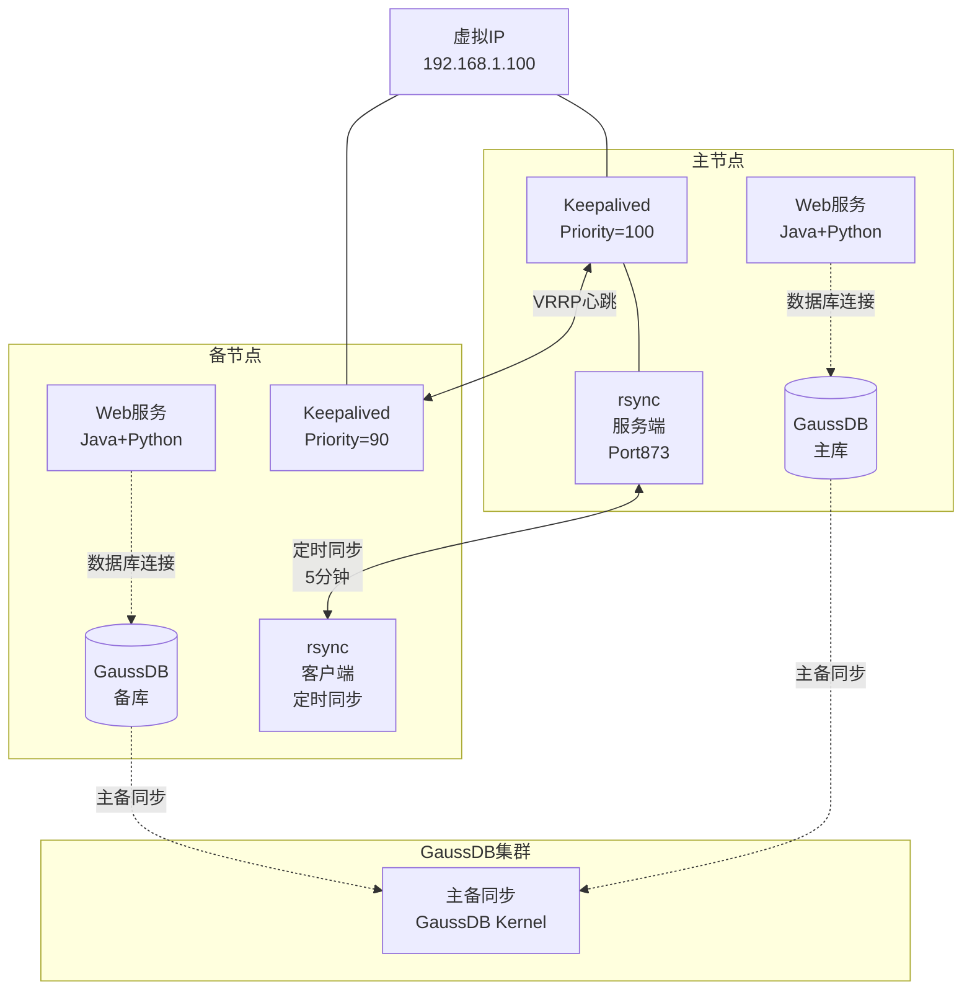
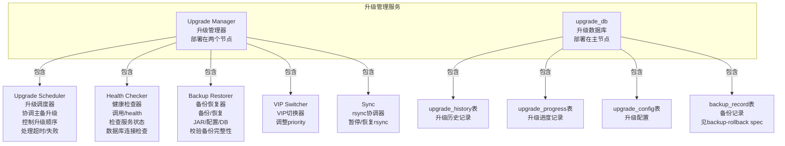
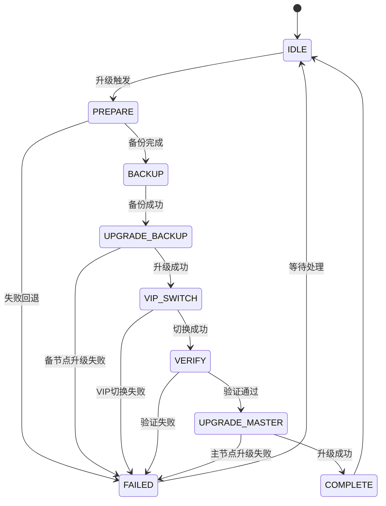
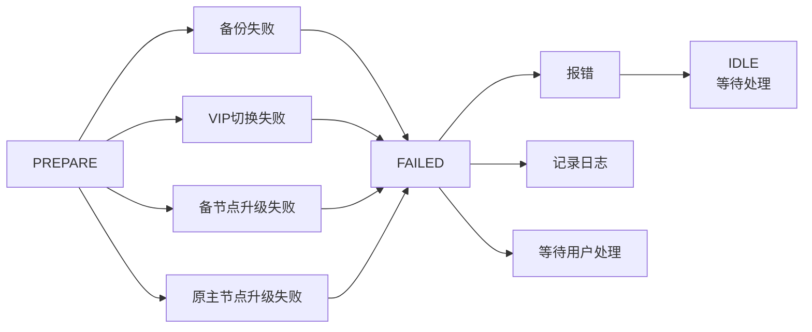
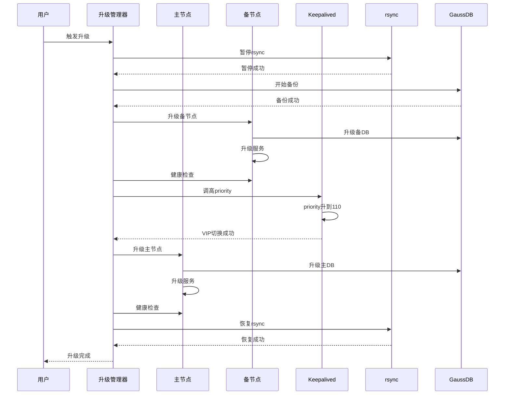
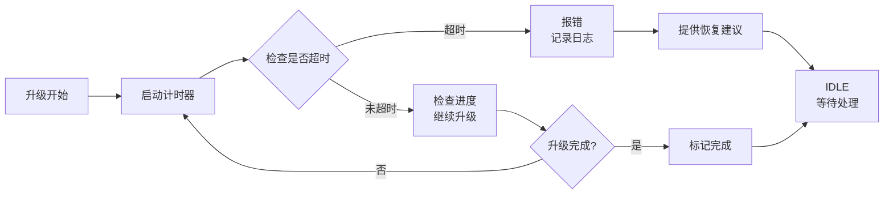

# 滚动升级流程管理

## ADDED Requirements

### Requirement: 系统支持主备节点滚动升级

系统 SHALL 在主备节点间自动协调升级顺序，采用先升级备节点、验证通过后再升级主节点的滚动升级策略。

#### Scenario: 成功的滚动升级流程
- **WHEN** 用户触发升级且系统处于正常运行状态（主节点提供服务，备节点待机）
- **THEN** 系统执行以下步骤：
  1. 暂停 rsync 配置同步
  2. 升级备节点（GaussDB + Web 服务）
  3. 健康检查验证备节点升级成功
  4. 触发 VIP 切换（备节点升为主节点）
  5. 升级原主节点（现已备节点）（GaussDB + Web 服务）
  6. 健康检查验证该节点升级成功
  7. 恢复 rsync 配置同步
  8. 升级总时间 SHALL 小于 4 分钟

#### Scenario: 备节点升级失败
- **WHEN** 备节点升级过程中失败（服务启动失败、健康检查超时、数据库升级失败）
- **THEN** 系统 SHALL：
  1. 立即停止升级流程
  2. 报错并记录详细失败日志
  3. 保持 VIP 在主节点，主节点继续提供服务
  4. 不触发自动回滚，等待用户手动处理

#### Scenario: VIP 切换失败
- **WHEN** VIP 切换超时（超过 30 秒未完成切换）
- **THEN** 系统 SHALL：
  1. 记录 VIP 切换失败日志
  2. 尝试重新触发 VIP 切换（最多 2 次重试）
  3. 如果仍失败，报错并保持当前主备节点角色
  4. 保持接口可用，以供回退接口调用

#### Scenario: 原主节点（现已备节点）升级失败
- **WHEN** 原 master 节点升级失败
- **THEN** 系统 SHALL：
  1. 报错并记录详细失败日志
  2. VIP 在新主节点（原备节点），服务继续可用
  3. 不触发自动回滚，等待用户手动回滚该节点

---

### Requirement: 系统控制升级总时间在 4 分钟以内

系统 SHALL 控制升级总时间（从触发到完成）小于 4 分钟，确保满足不停机升级要求。

#### Scenario: 正常升级流程的时间控制
- **WHEN** 升级流程正常执行
- **THEN** 升级总时间 SHALL 小于 4 分钟（单节点升级基线 2 分钟 + VIP 切换 30 秒 + 健康检查 30 秒 + 缓冲时间）

#### Scenario: 升级超时
- **WHEN** 升级流程超过 4 分钟未完成
- **THEN** 系统 SHALL：
  1. 报错并记录超时状态
  2. 提供升级进度详细信息
  3. 不自动终止升级，允许继续完成
  4. 等待用户手动介入处理

---

### Requirement: 系统处理升级失败和超时情况

系统 SHALL 提供完善的升级失败和超时处理机制，包括错误日志、进度反馈和恢复建议。

#### Scenario: 升级失败后错误日志记录
- **WHEN** 升级过程中发生任何失败
- **THEN** 系统 SHALL 记录详细的错误日志，包括：
  1. 失败时间
  2. 失败节点（主/备）
  3. 失败阶段（备份/数据库升级/服务升级/健康检查/VIP 切换）
  4. 失败原因（服务启动失败/健康检查超时/数据库连接失败/VIP 切换超时）
  5. 错误堆栈或错误消息

#### Scenario: 升级失败后进度反馈
- **WHEN** 升级失败或超时
- **THEN** 系统 SHALL 通过升级进度查询接口返回详细状态：
  1. 当前升级阶段
  2. 失败原因
  3. 已完成的部分
  4. 建议的恢复操作（重试/回滚/手动检查）

#### Scenario: 升级超时后的恢复
- **WHEN** 升级超时后用户介入
- **THEN** 系统 SHALL 支持：
  1. 从超时状态恢复，重新触发升级
  2. 手动回滚到升级前状态
  3. 保留当前升级进度日志供排查

---

## 数据模型

### 升级历史记录表（upgrade_history）

| 字段名 | 类型 | 描述 | 约束 |
|--------|------|------|--------|
| upgrade_id | BIGINT | 升级记录唯一标识 | PRIMARY KEY, AUTO_INCREMENT |
| start_time | DATETIME | 升级触发时间 | NOT NULL |
| end_time | DATETIME | 升级完成时间（失败时为 NULL） | NULLABLE |
| status | VARCHAR(20) | 升级状态 | NOT NULL, VALUES ('IN_PROGRESS', 'SUCCESS', 'FAILED', 'TIMEOUT', 'ROLLBACK') |
| current_phase | VARCHAR(50) | 当前升级阶段 | NULLABLE, VALUES ('PREPARE', 'BACKUP', 'UPGRADE_BACKUP', 'UPGRADE_MASTER', 'VIP_SWITCH', 'VERIFY', 'COMPLETE') |
| total_duration_seconds | INT | 总升级时长（秒） | NULLABLE |
| upgrade_package_path | VARCHAR(500) | 升级包路径 | NOT NULL |
| upgrade_package_version | VARCHAR(50) | 升级包版本号 | NOT NULL |
| current_version_before | VARCHAR(50) | 升级前版本号 | NOT NULL |
| current_version_after | VARCHAR(50) | 升级后版本号（成功时） | NULLABLE |
| error_message | TEXT | 失败错误消息 | NULLABLE |
| error_stack_trace | TEXT | 失败堆栈信息 | NULLABLE |
| rollback_available | BOOLEAN | 是否可回滚 | NOT NULL, DEFAULT FALSE |
| rollback_time | DATETIME | 回滚时间 | NULLABLE |
| created_at | DATETIME | 记录创建时间 | NOT NULL, DEFAULT CURRENT_TIMESTAMP |

### 升级进度记录表（upgrade_progress）

| 字段名 | 类型 | 描述 | 约束 |
|--------|------|------|--------|
| progress_id | BIGINT | 进度记录唯一标识 | PRIMARY KEY, AUTO_INCREMENT |
| upgrade_id | BIGINT | 关联的升级记录 ID | NOT NULL, FOREIGN KEY REFERENCES upgrade_history(upgrade_id) |
| node_type | VARCHAR(10) | 节点类型 | NOT NULL, VALUES ('MASTER', 'BACKUP') |
| phase | VARCHAR(50) | 当前阶段 | NOT NULL, VALUES ('PREPARE', 'BACKUP', 'UPGRADE_BACKUP', 'UPGRADE_MASTER', 'VIP_SWITCH', 'VERIFY', 'COMPLETE') |
| step | VARCHAR(100) | 具体步骤描述 | NOT NULL |
| step_status | VARCHAR(20) | 步骤状态 | NOT NULL, VALUES ('PENDING', 'IN_PROGRESS', 'SUCCESS', 'FAILED') |
| start_time | DATETIME | 步骤开始时间 | NOT NULL |
| end_time | DATETIME | 步骤结束时间 | NULLABLE |
| duration_seconds | INT | 步骤耗时（秒） | NULLABLE |
| message | TEXT | 步骤消息或错误信息 | NULLABLE |
| created_at | DATETIME | 记录创建时间 | NOT NULL, DEFAULT CURRENT_TIMESTAMP |

### 升级配置表（upgrade_config）

| 字段名 | 类型 | 描述 | 约束 |
|--------|------|------|--------|
| config_id | INT | 配置记录唯一标识 | PRIMARY KEY, AUTO_INCREMENT |
| config_key | VARCHAR(100) | 配置键 | NOT NULL, UNIQUE |
| config_value | VARCHAR(500) | 配置值 | NOT NULL |
| description | VARCHAR(500) | 配置描述 | NULLABLE |
| updated_at | DATETIME | 配置更新时间 | NOT NULL, DEFAULT CURRENT_TIMESTAMP ON UPDATE CURRENT_TIMESTAMP |

**默认配置项**：

| config_key | config_value | description |
|------------|---------------|-------------|
| upgrade.timeout_seconds | 240 | 单节点升级超时时间（4 分钟） |
| vip_switch.timeout_seconds | 30 | VIP 切换超时时间（30 秒） |
| health_check.timeout_seconds | 30 | 健康检查超时时间（30 秒） |
| health_check.retry_count | 3 | 健康检查重试次数 |
| auto_rollback | FALSE | 是否自动回滚（FALSE 为手动回滚） |
| rsync.pause_on_upgrade | TRUE | 升级时是否暂停 rsync |
| backup.retention_days | 7 | 备份保留天数 |

---

## 部署视图

### 系统组件部署架构

### 升级管理服务部署

---

## 运行视图

### 滚动升级流程状态机

### 升级失败处理流程

### 升级时序图

### 超时处理流程

